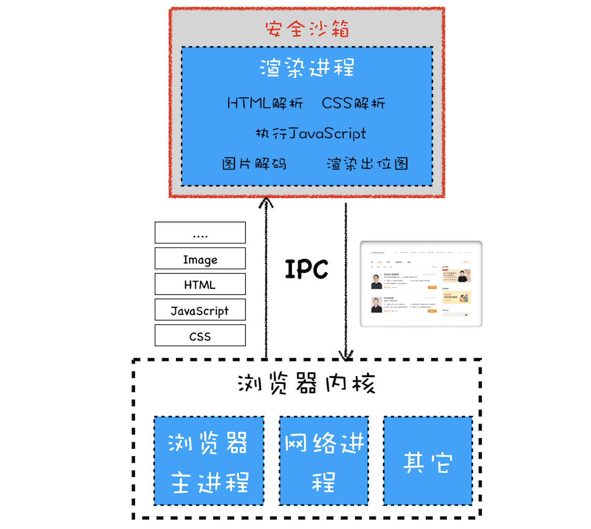

- [系统安全](#系统安全)
  - [安全沙箱](#安全沙箱)
    - [安全沙箱如何影响各个模块功能?](#安全沙箱如何影响各个模块功能)
  - [站点隔离（Site Isolation）](#站点隔离site-isolation)
  - [安全沙箱能防止 XSS 或者 CSRF 一类的攻击的吗？](#安全沙箱能防止-xss-或者-csrf-一类的攻击的吗)
- [网络安全](#网络安全)

# 系统安全
>参考链接：https://time.geekbang.org/column/article/155183?utm_term=zeusQYFJN&utm_source=app&utm_medium=geektime&utm_campaign=216-end&utm_content=v8zhuanlankaipianci0316

浏览器架构在最开始的阶段，浏览器是单进程的，这意味着渲染过程、JavaScript 执行过程、网络加载过程、UI 绘制过程和页面显示过程等都是在**同一个进程**中执行的。

单进程架构，不仅会导致浏览器运行的不稳定，还容易由于浏览器暴露出漏洞未及时修复而受到黑客攻击。这种攻击是可以入侵到浏览器进程内部的，可以读取和修改浏览器进程内部的任意内容，还可以穿透浏览器，在用户的操作系统上悄悄地安装恶意软件、监听用户键盘输入信息以及读取用户硬盘上的文件内容。

现代浏览器的设计目标是安全、快速和稳定，所以在设计现代浏览器的体系架构时，需要解决这个问题。

从操作系统安全的视角来看浏览器的多进程架构，如下图：

浏览器被划分为**浏览器内核**和**渲染内核**两个核心模块
* 浏览器内核是由网络进程、浏览器主进程和 GPU 进程组成的
* 渲染内核就是渲染进程

该两模块工作过程如下：
1. 所有的网络资源都是通过浏览器内核来下载的，
2. 下载后的资源会通过 IPC 将其提交给渲染进程（浏览器内核和渲染进程之间都是通过 IPC 来通信的）。
3. 然后渲染进程会对这些资源进行解析、绘制等操作，最终生成一幅图片。
4. 但是渲染进程并不负责将图片显示到界面上，而是将最终生成的图片提交给浏览器内核模块，由浏览器**内核模块负责显示这张图片**。

## 安全沙箱
由于渲染进程需要执行 DOM 解析、CSS 解析、网络图片解码等操作，如果**渲染进程**中存在系统级别的漏洞，那么以上操作就有可能让恶意的站点获取到渲染进程的控制权限，进而又获取操作系统的控制权限，这对于用户来说是非常危险的。

所以需要在渲染进程和操作系统之间建一道墙，即便渲染进程由于存在漏洞被黑客攻击，但由于这道墙，黑客就获取不到渲染进程之外的任何操作权限。**将渲染进程和操作系统隔离的这道墙就是我们要聊的安全沙箱**。

浏览器中的`安全沙箱`是利用`操作系统提供的安全技术`，让渲染进程在执行过程中无法访问或者修改操作系统中的数据，在渲染进程需要访问系统资源的时候，需要通过浏览器内核来实现，然后将访问的结果通过 IPC 转发给渲染进程。

安全沙箱最小的保护单位是**进程**。

### 安全沙箱如何影响各个模块功能?
我们知道安全沙箱最小的保护单位是进程，并且能限制进程对操作系统资源的访问和修改，这就意味着如果要让安全沙箱应用在某个进程上，那么这个进程必须没有读写操作系统的功能，比如读写本地文件、发起网络请求、调用 GPU 接口等。

在有安全沙箱的情况下，渲染进程和浏览器内核各自的职责如下：

1. **持久存储**
   
   现代浏览器将读写文件的操作全部放在了**浏览器内核**中实现，然后通过 `IPC` 将操作结果转发给渲染进程。
   * 存储 Cookie 数据的读写。通常浏览器内核会维护一个存放所有 Cookie 的 Cookie 数据库，然后当渲染进程通过 JavaScript 来读取 Cookie 时，渲染进程会通过 IPC 将读取 Cookie 的信息发送给浏览器内核，浏览器内核读取 Cookie 之后再将内容返回给渲染进程。
   * 一些缓存文件的读写也是由浏览器内核实现的，比如网络文件缓存的读取。
2. **网络访问**

   在渲染进程内部也是不能直接访问网络的，如果要访问网络，则需要通过浏览器内核。

   浏览器内核在处理 URL 请求之前，会检查渲染进程是否有权限请求该 URL，比如检查 XMLHttpRequest 或者 Fetch 是否是**跨站点请求**，或者检测 **HTTPS** 的站点中是否包含了 HTTP 的请求。

3. **用户交互**
   
   通常情况下，如果你要实现一个 UI 程序，操作系统会提供一个界面给你，该界面允许应用程序与用户交互，允许应用程序在该界面上进行绘制，比如 Windows 提供的是 HWND，Linux 提供的 X Window，我们就把 HWND 和 X Window 统称为窗口句柄。应用程序可以在窗口句柄上进行绘制和接收**键盘鼠标**消息。

   由于每个渲染进程都有安全沙箱的保护，所以在渲染进程内部是无法直接操作窗口句柄的，这也是为了限制渲染进程监控到用户的输入事件。所以渲染进程需要完成以下两点大的改变。
   1. 渲染进程需要渲染出位图。
   2. 操作系统没有将用户输入事件直接传递给渲染进程，而是将这些事件传递给浏览器内核。然后浏览器内核再根据当前浏览器界面的状态来判断如何调度这些事件，如果当前焦点位于浏览器地址栏中，则输入事件会在浏览器内核内部处理；如果当前焦点在页面的区域内，则浏览器内核会将输入事件转发给渲染进程。

## 站点隔离（Site Isolation）
所谓站点隔离是指 Chrome 将同一站点（包含了相同根域名和相同协议的地址）中相互关联的页面放到同一个渲染进程中执行。

最开始 Chrome 划分渲染进程是以标签页为单位，也就是说整个标签页会被划分给某个渲染进程。但是，按照标签页划分渲染进程存在一些问题，原因就是一个标签页中可能包含了多个 iframe，而这些 iframe 又有可能来自于**不同**的站点，这就导致了多个不同站点中的内容通过 iframe 同时运行在同一个渲染进程中。

这将导致两个A级漏洞--幽灵（Spectre）和熔毁（Meltdown），很难修补，黑客通过这两个漏洞可以直接入侵到进程的内部，如果入侵的进程没有安全沙箱的保护，那么黑客还可以发起对操作系统的攻击。

实现了**站点隔离**，就可以将恶意的 iframe 隔离在恶意进程内部，使得它无法继续访问其他 iframe 进程的内容，因此也就无法攻击其他站点了。

> 2019 年 10 月 20 日 Chrome 团队宣布安卓版的 Chrome 已经全面支持站点隔离

## 安全沙箱能防止 XSS 或者 CSRF 一类的攻击的吗？
安全沙箱是不能防止 XSS 或者 CSRF 一类的攻击，

安全沙箱的目的是隔离渲染进程和操作系统，让渲染进行没有访问操作系统的权利

XSS 或者 CSRF 主要是利用网络资源获取用户的信息，这**和操作系统没有关系的**

# 网络安全
网络安全协议 HTTPS

详见《http，https》章节