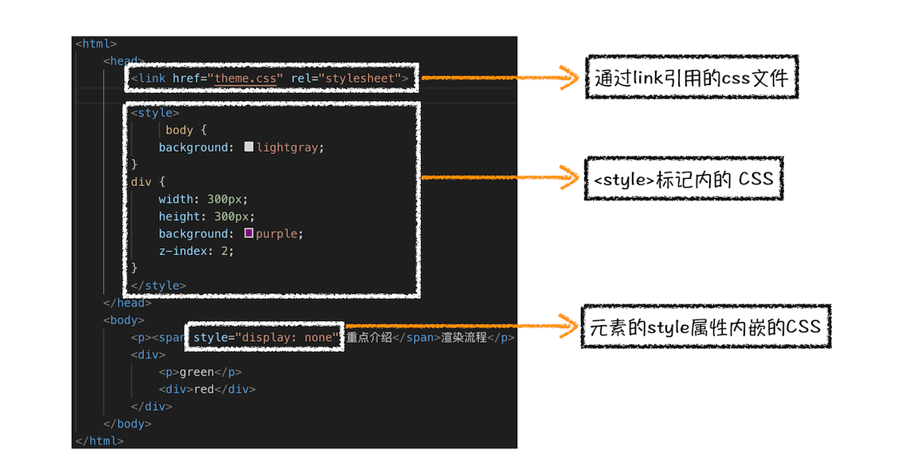
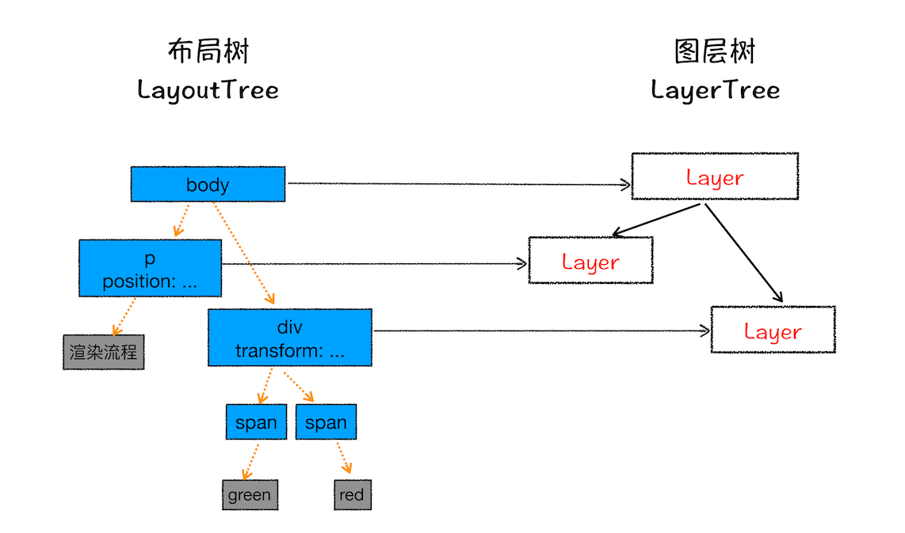
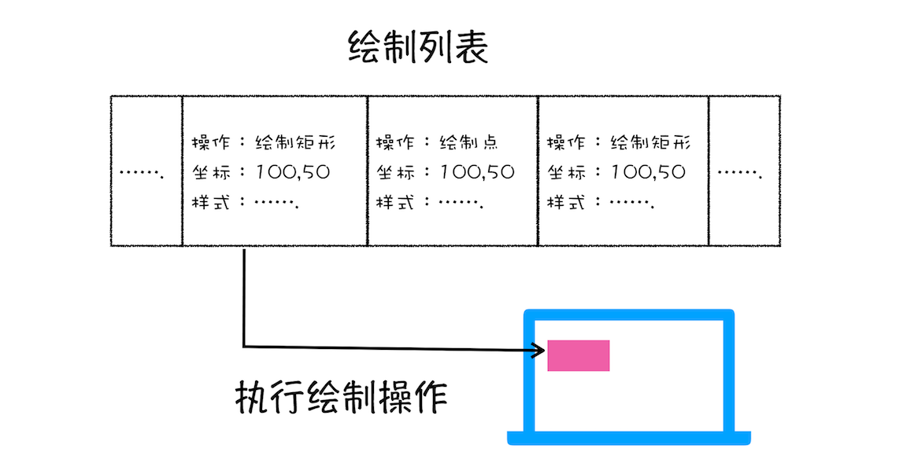

- [前言](#前言)
- [构建DOM树](#构建dom树)
- [样式计算](#样式计算)
  - [把 CSS 转换为浏览器能够理解的结构](#把-css-转换为浏览器能够理解的结构)
  - [转换样式表中的属性值，使其标准化](#转换样式表中的属性值使其标准化)
  - [计算出 DOM 树中每个节点的具体样式](#计算出-dom-树中每个节点的具体样式)
- [布局阶段](#布局阶段)
  - [创建布局树](#创建布局树)
  - [布局计算](#布局计算)
- [分层](#分层)
- [图层绘制](#图层绘制)
- [栅格化（raster）操作](#栅格化raster操作)
- [总结](#总结)
- [相关概念](#相关概念)
  - [重排（更新了元素的几何属性）](#重排更新了元素的几何属性)
  - [重绘（更新元素的绘制属）](#重绘更新元素的绘制属)
  - [合成](#合成)

[参考链接](https://time.geekbang.org/column/article/118205?utm_term=zeusQYFJN&utm_source=app&utm_medium=geektime&utm_campaign=216-end&utm_content=v8zhuanlankaipianci0316)

# 前言
通常，我们编写好 HTML、CSS、JavaScript 等文件，经过浏览器就会显示出漂亮的页面。

由于渲染机制过于复杂，所以渲染模块在执行过程中会被划分为很多子阶段，输入的 HTML 经过这些子阶段，最后输出**像素**。我们把这样的一个处理流程叫做渲染流水线，其大致流程如下图所示：

流水线可分为如下几个子阶段：`构建 DOM 树、样式计算、布局阶段、分层、绘制、分块、光栅化和合成`。

# 构建DOM树
这是因为浏览器无法直接理解和使用 HTML，所以需要将 HTML 转换为浏览器能够理解的结构——`DOM 树`。

构建 DOM 树的输入内容是一个非常简单的 HTML 文件，然后经由 HTML 解析器解析，最终输出树状结构的 DOM。

# 样式计算
css样式来源有三种

样式计算的目的是为了计算出 **DOM 节点中每个元素的具体样式**，这个阶段大体可分为三步来完成。

## 把 CSS 转换为浏览器能够理解的结构
   
和 HTML 文件一样，浏览器也是无法直接理解这些纯文本的 CSS 样式，所以当渲染引擎接收到 CSS 文本时，会执行一个转换操作，将 CSS 文本转换为浏览器可以理解的结构——`styleSheets`。

>可在浏览器控制台通过`document.styleSheets`查看styleSheets结构
## 转换样式表中的属性值，使其标准化
  
CSS 文本中有很多属性值，如 2em、blue、bold，这些类型数值不容易被渲染引擎理解，所以**需要将所有值转换为渲染引擎容易理解的、标准化的计算值**，这个过程就是属性值标准化。

## 计算出 DOM 树中每个节点的具体样式
现在样式的属性已被标准化了，接下来就需要计算 DOM 树中每个节点的样式属性。

这里涉及到 CSS 的[`继承规则`和`层叠规则`](https://developer.mozilla.org/zh-CN/docs/Learn/CSS/Building_blocks/Cascade_and_inheritance)。
* 继承：每个 DOM 节点都包含有父节点的样式
* 层叠：

# 布局阶段
有了 `DOM 树`和 `DOM 树中元素的样式`之后，就需要计算出 DOM 树中可见元素的**几何位置**，我们把这个计算过程叫做`布局`。

Chrome 在布局阶段需要完成两个任务：创建布局树和布局计算。

## 创建布局树
DOM 树还含有很多不可见的元素，比如 head 标签，还有使用了 display:none 属性的元素。所以在显示之前，我们还要额外地构建一棵**只包含可见元素布局树**。

为了构建布局树，浏览器大体上完成了下面这些工作：
* 遍历 DOM 树中的所有**可见**节点，并把这些节点加到布局树中；
* 而**不可见**的节点会被布局树忽略掉，如 head 标签下面的全部内容，再比如 body.p.span 这个元素，因为它的属性包含 dispaly:none，所以这个元素也没有被包进布局树。

## 布局计算
现在我们有了一棵完整的布局树。那么接下来，就要计算布局树节点的坐标位置了。

# 分层
现在我们有了布局树，而且每个元素的具体位置信息都计算出来了，但接下来依然不是绘制页面。

因为页面中有很多复杂的效果，如一些复杂的 3D 变换、页面滚动，或者使用 z-indexing 做 z 轴排序等，为了更加方便地实现这些效果，渲染引擎还需要为特定的节点生成专用的图层，并生成一棵对应的`图层树（LayerTree）`。

浏览器的页面实际上被分成了很多图层，这些图层叠加后合成了最终的页面。这些图层和布局树节点之间的关系，如文中图所示：

并不是布局树的每个节点都包含一个图层，如果一个节点没有对应的层，那么这个节点就从属于父节点的图层。

通常满足下面两点中任意一点的元素就可以被提升为单独的一个图层。
* 拥有[层叠上下文属性](https://developer.mozilla.org/zh-CN/docs/Web/CSS/CSS_Positioning/Understanding_z_index/The_stacking_context)（比如：flex,position,grid等）的元素会被提升为单独的一层。
* 需要剪裁（比如，内容超出容器大小）的地方也会被创建为图层。

# 图层绘制
渲染引擎会把一个图层的绘制拆分成很多小的绘制指令，然后再把这些指令按照顺序组成一个待绘制列表，如下图所示：

# 栅格化（raster）操作
绘制列表只是用来记录绘制顺序和绘制指令的列表，而实际上绘制操作是由**渲染引擎中的合成线程**来完成的。

# 总结

1. 渲染进程将 HTML 内容转换为能够读懂的`DOM 树`结构。
2. 渲染引擎将 CSS 样式表转化为浏览器可以理解的 `styleSheets`，计算出 DOM 节点的样式。
3. 创建`布局树`，并计算元素的布局信息。
4. 对布局树进行分层，并生成`分层树`。
5. 为每个图层生成`绘制列表`，并将其提交到合成线程。
6. 合成线程将图层分成`图块`，并在`光栅化线程池`中将图块转换成位图。
7. 合成线程发送绘制图块命令 `DrawQuad` 给浏览器进程。
8. 浏览器进程根据 DrawQuad 消息`生成页面`，并`显示`到显示器上。

# 相关概念
## 重排（更新了元素的几何属性）
如果你通过 JavaScript 或者 CSS 修改元素的几何位置属性，例如改变元素的宽度、高度等，那么**浏览器会触发重新布局**，解析之后的一系列子阶段，这个过程就叫`重排`。无疑，重排需要更新完整的渲染流水线，所以开销也是最大的。

## 重绘（更新元素的绘制属）
如果修改了元素的背景颜色，那么布局阶段将不会被执行，因为并没有引起几何位置的变换，所以就直接进入了绘制阶段，然后执行之后的一系列子阶段，这个过程就叫`重绘`。相较于重排操作，重绘省去了布局和分层阶段，所以执行效率会比重排操作要高一些。

## 合成
如果你更改一个既不要布局也不要绘制的属性，会发生什么变化呢？渲染引擎将跳过布局和绘制，只执行后续的合成操作，我们把这个过程叫做`合成`。

比如使用了 CSS 的` transform `来实现动画效果，这可以避开重排和重绘阶段，直接在非主线程上执行合成动画操作。这样的效率是最高的，因为是在非主线程上合成，并没有占用主线程的资源，另外也避开了布局和绘制两个子阶段，所以相对于重绘和重排，合成能大大提升绘制效率。