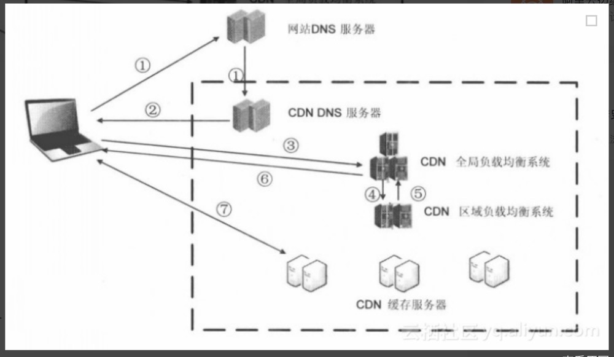

- [CDN缓存](#cdn缓存)
  - [cdn是什么？](#cdn是什么)
  - [cdn原理（过程）](#cdn原理过程)
  - [cdn缓存基本原理](#cdn缓存基本原理)
  - [cdn缓存策略](#cdn缓存策略)
  - [CDN缓存应用场景](#cdn缓存应用场景)
- [DNS缓存](#dns缓存)
  - [DNS是什么？](#dns是什么)

# CDN缓存
[参考链接](https://serverless-action.com/fontend/fe-optimization/%E5%89%8D%E7%AB%AF%E6%80%A7%E8%83%BD%E4%BC%98%E5%8C%96-CDN-%E7%BC%93%E5%AD%98.html)

## cdn是什么？
**cdn是内容分发网络**

CDN是将源站内容分发至最接近用户的节点，使用户可就近取得所需内容，提高用户访问的响应速度和成功率。解决因分布、带宽、服务器性能带来的访问延迟问题，适用于站点加速、点播、直播等场景。

CDN就可以理解为分布在每个县城的火车票代售点，用户在浏览网站的时候，CDN会选择一个离用户最近的CDN边缘节点来响应用户的请求，这样海南移动用户的请求就不会千里迢迢跑到北京电信机房的服务器（假设源站部署在北京电信机房）上了。

## cdn原理（过程）

1. 当用户点击网站页面上的内容URL，经过`本地DNS系统`解析，DNS系统会最终将域名的解析权交给CNAME指向的`CDN专用DNS服务器`。
2. CDN的DNS服务器将CDN的全局`负载均衡设备IP地址`返回用户。
3. 用户向CDN的全局负载均衡设备发起URL访问请求。
4. CDN全局负载均衡设备根据用户IP地址，以及用户请求的内容URL，选择一台用户所属区域的`区域负载均衡设备`，告诉用户向这台设备发起请求。
5. 区域负载均衡设备会为用户选择一台合适的服务器提供服务，并将该`服务器的ip地址`返回给`全局负载均衡设备`。选择的依据包括：根据用户IP地址，判断哪一台服务器距用户最近；根据用户所请求的URL中携带的内容名称，**判断哪一台服务器上有用户所需内容**；查询各个服务器当前的负载情况，判断哪一台服务器尚有服务能力。
6. 全局负载均衡设备把查询到的服务器的IP地址返回给`用户`。
7. 用户向服务器发起请求，服务器响应用户请求，将用户所需内容传送到用户终端。如果这台缓存服务器上并没有用户想要的内容，而区域均衡设备依然将它分配给了用户，那么这台服务器就要向它的上一级缓存服务器请求内容，直至追溯到网站的源服务器将内容拉到本地。

**ps：负载均衡**
负载均衡（Load Balance），意思是将负载（工作任务，访问请求）进行平衡、分摊到多个操作单元（服务器，组件）上进行执行。是解决高性能，单点故障（高可用），扩展性（水平伸缩）的终极解决方案。

## cdn缓存基本原理
CDN 的基本原理是广泛采用各种`缓存服务器`，将这些缓存服务器分布到用户访问相对集中的地区或网络中，在用户访问网站时，利用全局负载技术将用户的访问指向距离最近的工作正常的缓存服务器上，由缓存服务器直接响应用户请求。

CDN 的核心点有两个，一个是`缓存`，一个是`回源`。
* **缓存**就是说我们把资源 copy 一份到 CDN 服务器上这个过程
* **回源**就是说 CDN 发现自己没有这个资源（一般是缓存的数据过期了），转头向根服务器（或者它的上层服务器）去要这个资源的过程。

## cdn缓存策略
CDN边缘节点缓存策略因服务商不同而不同，但一般都会遵循**http标准协议**，通过http响应头中的`Cache-control: max-age`的字段来设置CDN边缘节点数据缓存时间。

## CDN缓存应用场景
* CDN 往往被用来存放`静态资源`：所谓“静态资源”，就是像 JS、CSS、图片等不需要业务服务器进行计算即得的资源。
* 直播传送：直播本质上是使用流媒体进行传送，那么CDN也是支持流媒体传送的，所以直播完全可以使用CDN来提高访问速度。CDN在处理流媒体的时候与处理普通静态文件有所不同，普通文件如果在边缘节点没有找到的话，就会去上一层接着寻找，但是流媒体本身数据量就非常大，如果使用回源的方式，必然会带来性能问题，所以流媒体一般采用的都是主动推送的方式来进行。

# DNS缓存
## DNS是什么？
通俗一点，DNS其实就是一个电话本翻译系统，用来把**域名解析成对应的IP地址**。

对于前端来说，DNS就是从浏览器输入域名后，浏览器与DNS服务器交互，最终浏览器向DNS解析返回的IP地址建立TCP连接的过程。

从输入域名到返回结果，经历的每一步，都可能有缓存。如果有缓存，就不会进行下一步，直到达到全球只有13台的跟域名服务器；

