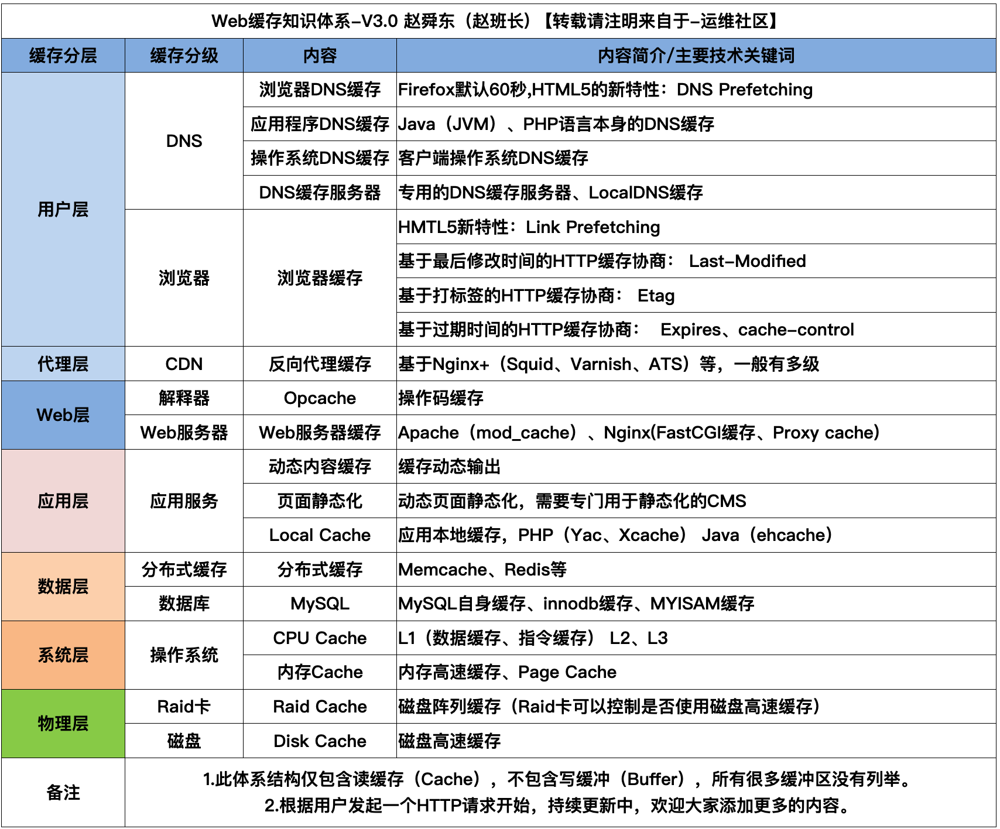
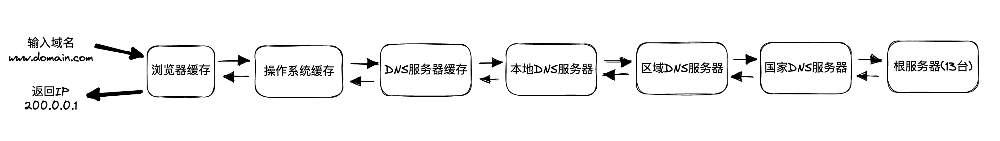
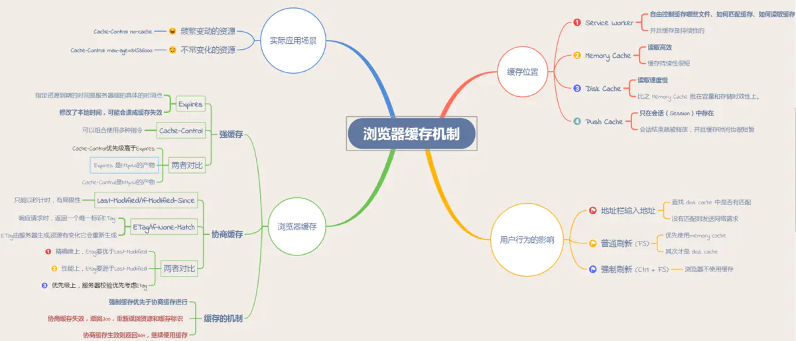
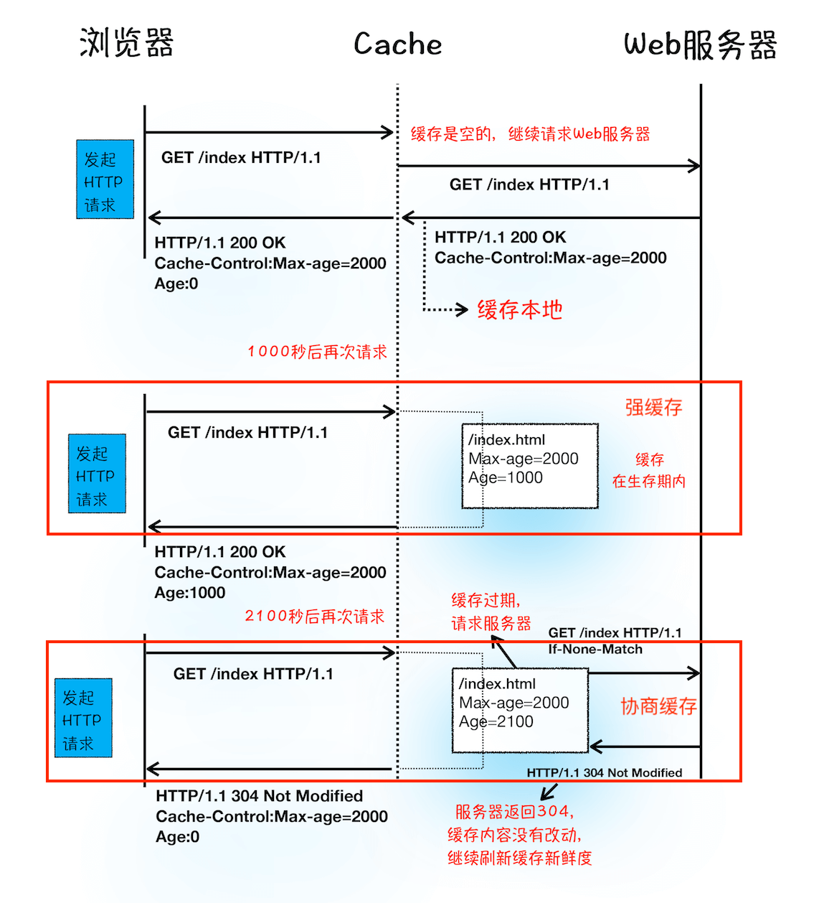
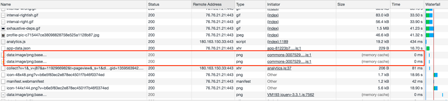
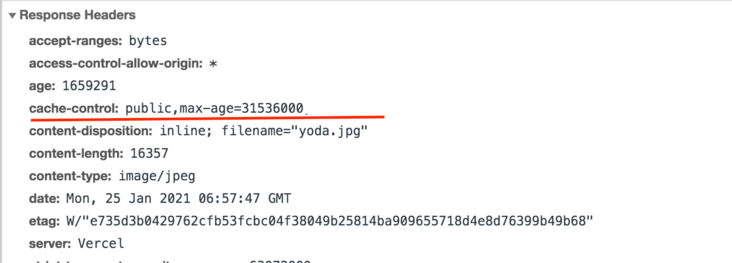

- [前言 - Web缓存知识体系](#前言---web缓存知识体系)
  - [缓存位置](#缓存位置)
  - [浏览器缓存过程](#浏览器缓存过程)
  - [缓存机制](#缓存机制)
- [强缓存](#强缓存)
  - [http 响应头：Expires](#http-响应头expires)
  - [http 响应头：Cache-Control](#http-响应头cache-control)
- [协商缓存](#协商缓存)
  - [协商缓存过程(相关状态码：304/200)](#协商缓存过程相关状态码304200)
  - [http 头：Last-Modified／If-Modified-since(http 1.0)](#http-头last-modifiedif-modified-sincehttp-10)
  - [http 头：Etag/If-None-match(http 1.1)](#http-头etagif-none-matchhttp-11)
- [总结 强缓存和协商缓存](#总结-强缓存和协商缓存)
- [启发式缓存阶段](#启发式缓存阶段)
- [用户行为对浏览器缓存的影响](#用户行为对浏览器缓存的影响)

# 前言 - Web缓存知识体系

Web缓存知识体系，如下图:


其实缓存有很多种，包括：浏览器缓存，DNS缓存，CDN缓存等等。

从输入域名到返回结果，经历的每一步，都可能有缓存。如果有缓存，就不会进行下一步，直到达到全球只有13台的跟域名服务器；


今天主要介绍的就是浏览器缓存
在本文主要介绍`浏览器`中的缓存:



>[参考链接](https://www.jianshu.com/p/54cc04190252)

## 缓存位置

从缓存位置上来说分为四种，并且各自有优先级，当依次查找缓存且都没有命中的时候，才会去请求网络。

- `Service Worker`：运行在浏览器背后的独立线程，一般可以用来实现缓存功能。必须使用 HTTPS 协议来保障安全。
- `Memory Cache`：内存缓存读取高效，但缓存持续性很短，会随着进程的释放而释放。且内存空间有限。
当我们访问过页面以后，再次刷新页面，可以发现很多数据都来自于内存缓存。
内存缓存在缓存资源时并不关心返回资源的HTTP缓存头Cache-Control是什么值，同时资源的匹配也并非仅仅是对URL做匹配，还可能会对Content-Type，CORS等其他特征做校验。
- `Disk Cache`：存储在硬盘中的缓存，胜在容量和存储时效性上。
它会根据`·HTTP Herder 中的字段`判断哪些资源需要缓存，哪些资源可以不请求直接使用，哪些资源已经过期需要重新请求。并且即使在跨站点的情况下，相同地址的资源一旦被硬盘缓存下来，就不会再次去请求数据。
- `Push Cache`：当以上三种缓存都没有命中时，它才会被使用。它只在会话（Session）中存在，一旦会话结束就被释放，并且缓存时间也很短暂，在Chrome浏览器中只有5分钟左右，同时它也并非严格执行HTTP头中的缓存指令。

如果以上四种缓存都没有命中的话，那么只能发起请求来获取资源了。

**通常浏览器缓存策略分为两种：`强缓存`和`协商缓存`，并且缓存策略都是通过设置 HTTP Header 来实现的。**

## 浏览器缓存过程

- 浏览器每次拿到返回的请求结果都会将该结果和缓存标识存入浏览器缓存中

- 浏览器每次发起请求，都会先在浏览器缓存中查找该请求的结果以及缓存标识



>[参考链接](https://time.geekbang.org/column/article/116588?utm_term=zeusQYFJN&utm_source=app&utm_medium=geektime&utm_campaign=216-end&utm_content=v8zhuanlankaipianci0316)
>
## 缓存机制

- `强缓存`优先于`协商缓存`进行，

- 若强制缓存(相关http头：`Expires和Cache-Control`)生效则直接使用缓存，
- 若强缓存不生效（1. 缓存过期 2.Cache-Control: no-store）则进行协商缓存(相关http头：`Last-Modified / If-Modified-Since`和`Etag / If-None-Match`)，
- 协商缓存由**服务器**决定是否使用缓存，
- 若协商缓存失效，那么代表该请求的缓存失效，返回200，重新返回**资源和缓存标识**，再存入浏览器缓存中；
- 生效则返回`304`和`not modified`，继续使用缓存。

# 强缓存

当请求命中**强制缓存**时，浏览器不会将本次请求发往服务器，而是直接从缓存中读取内容，在Chrome中打开控制台，在network中显示的是`memory cache`或者是`disk cache`。


强缓存可以通过设置两种**HTTP Header**实现：`Expires(1.0)`和`Cache-Control(1.1)`。

## http 响应头：Expires

`Expires`是一个**绝对**时间，是缓存过期时间。用以表达在这个时间点之前发起请求可以直接从浏览器中读取数据，而无需重新发起请求。值为一个时间戳。

缺点：
Expires 是 HTTP/1.0 的产物，**受限于本地时间**，如果修改了本地时间，可能会造成缓存失效。

```
Expires: Wed, 22 Oct 2018 08:41:00 GMT // 表示资源会在 Wed, 22 Oct 2018 08:41:00 GMT 后过期，需要再次请求。
```

## http 响应头：Cache-Control

`Cache-Control`的**优先级比Expires的优先级高**。是HTTP/1.1产物。该字段表示资源缓存最大有效时间，在该时间内，客户端不需要向服务器发送请求。

Cache-Control解决了Expires在浏览器中，时间被手动更改导致缓存判断错误的问题。

**常见指令**如下(完整列表参考[MDN](https://developer.mozilla.org/zh-CN/docs/Web/HTTP/Headers/Cache-Control))：

- `private`(默认值)：客户端可以缓存，代理服务器不能缓存
- `public`：客户端和代理服务器都可缓存
- `no-cache`：在发布缓存副本之前，强制要求缓存把请求提交给原始服务器进行验证(协商缓存验证)
- `max-age`：设置缓存存储的最大周期，超过这个时间缓存被认为过期(单位秒)
- `no-store`：缓存不应该存储有关客户端请求或服务器响应的任何内容，即使不使用任何缓存

举个例子🌰：



图中Cache-Control指定了`max-age`，`public`，缓存时间为31536000秒（365天）。
也就是说，在365天内再次请求这条数据，都会直接获取缓存数据库中的数据，直接使用。

优点：

- 解决了Expires服务器和客户端相对时间的问题

缺点：

- 存在版本问题，到期之前的修改客户端是不可知的。

# 协商缓存

协商缓存就是 **强制缓存失效，1. 缓存过期 2. `Cache-Control：no-store`** 后，浏览器携带缓存标识向服务器发起请求，由服务器根据缓存标识决定是否使用缓存的过程。而整个过程是需要发出请求的。

协商缓存由**2组字段**(不是2个)，控制协商缓存的字段有：

- `Etag/If-None-match(http 1.1)`: 表示的是服务器资源的**唯一标识**，只要资源有变化，Etag就会重新生成；
- `Last-Modified／If-Modified-since(http 1.0)`: 表示的是服务器的资源**最后一次修改的时间**；

**Etag/If-None-match 的优先级高于Last-Modified/If-Modified-since。**

## 协商缓存过程(相关状态码：304/200)

使用协商缓存有两种情况：

- 协商缓存**生效**，返回`304`和空响应体，直接从缓存中读取
  
- 协商缓存**失效**，返回`200`和`请求结果`
  

## http 头：Last-Modified／If-Modified-since(http 1.0)

- 服务器通过 `Last-Modified` 字段告知客户端(返回资源的同时在header添加)，表示资源最后一次被修改的时间，浏览器将这个值和内容一起记录在缓存数据库中

- 下一次请求相同的资源时，浏览器会从自己的缓存中找出“不确定是否过期的”缓存，因此在请求头中将上次的Last-Modified的值写入到请求头的`If-Modified-since`字段
- 服务器会将If-Modified-since的值与**服务器中这个资源的最后修改时间**进行对比。如果没有变化，这表示未修改，响应304和空响应体，直接从缓存中读取；如果If-Modified-since**小于**最后修改时间，则表示修改了，响应 200 状态码，并返回数据

**缺点：**

1. 只要资源发生了修改，**无论内容是否发生了实质性的改变**，都会将该资源返回客户端。例如周期性重写，但这种情况下资源包含的数据实质是一样的。
2. 以时刻作为标识，无法识别**一秒内多次修改的情况**。如果资源更新的速度是**秒**以下的单位，那么该缓存是不能被使用的，因为它的时间最低单位是秒。

## http 头：Etag/If-None-match(http 1.1)

为了解决上述问题，出现了一组新的字段`Etag/In-None-Match`。

- `Etag`是上一次加载资源时，**服务器**返回的当前资源文件的一个**唯一标识**。它的作用是用来标识资源**是否有变化**。
- 浏览器在下一次发起请求时，会将上一次返回的Etag值赋值给`If-None-Match`并添加在 请求 Header 中。服务端匹配传入的值与上次是否一致，如果一致返回`304`，浏览器则读取本地缓存；否则返回`200和更新后的资源及新的Etag`

**优点：**

1. 可以更加精确的判断资源是否被修改，可以识别一秒内多次修改的情况
2. 不存在版本问题，每次请求都会去服务器进行校验
**缺点：**
1. 计算Etag值需要性能损耗
2. 分布式服务器存储情况下下，计算Etag的算法如果不一致，会导致浏览器从一个服务器上获取得页面内容后到另一台服务器上进行验证时出现Etag不匹配的情况

# 总结 强缓存和协商缓存

- 对于强制缓存，服务器通知浏览器一个**缓存时间**，在缓存时间内，下次请求，直接用缓存。如果不在缓存时间内，执行协商缓存策略。

- 对于协商缓存，将缓存信息中的Etag和Last-Modified通过请求发送给服务器，由**服务器校验**，返回304状态码时，浏览器直接使用缓存。

# 启发式缓存阶段

浏览器用来确定缓存过期时间的字段一个都没有！那该怎么办？有人可能会说下次请求直接进入协商缓存阶段。

不是的，浏览器还有个`启发式缓存阶段`。

**根据响应头中2个时间字段` Date `和 `Last-Modified` 之间的时间差值，取其值的10%作为缓存时间周期。**

这就是启发式缓存阶段。这个阶段很容让人忽视，但实际上每时每刻都在发挥着作用。

# 用户行为对浏览器缓存的影响

所谓用户行为对浏览器缓存的影响，指的就是用户在浏览器如何操作时，会触发怎样的缓存策略。主要有 3 种：

- 打开网页，地址栏输入地址： 查找 disk cache 中是否有匹配。如有则使用；如没有则发送网络请求。
- **普通刷新 (F5)**：因为 TAB 并没有关闭，因此 memory cache 是可用的，会被优先使用(如果匹配的话)。其次才是 disk cache。
- **强制刷新 (Ctrl + F5)**：浏览器不使用缓存，因此发送的请求头部均带有 Cache-control: no-cache(为了兼容，还带了 Pragma: no-cache),服务器直接返回 200 和最新内容。
