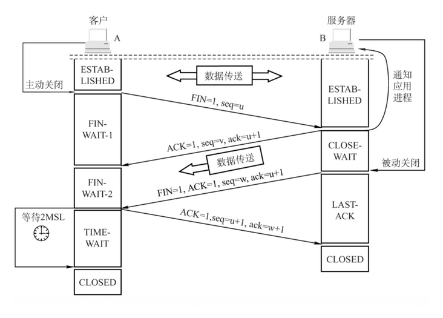

- [计算机网络体系](#计算机网络体系)
- [TCP协议](#tcp协议)
  - [三次握手](#三次握手)
    - [为什么要三次握手？](#为什么要三次握手)
    - [三次握手过程中可以携带数据吗？](#三次握手过程中可以携带数据吗)
    - [SYN 洪泛攻击](#syn-洪泛攻击)
    - [如果第三次握手丢失了，客户端服务端会如何处理 - 重传机制](#如果第三次握手丢失了客户端服务端会如何处理---重传机制)
  - [四次挥手](#四次挥手)
    - [等待2MSL的意义](#等待2msl的意义)
    - [为什么是4次挥手](#为什么是4次挥手)
- [DNS解析，域名解析](#dns解析域名解析)

# 计算机网络体系
计算机网络体系结构分为3种：OSI体系结构（七层），TCP/IP体系结构（四层）。

# TCP协议
> [参考链接](https://segmentfault.com/a/1190000039165592)

tcp协议是**传输层**协议。TCP（Transmission Control Protocol，传输控制协议）是面向连接的协议，也就是说，在收发数据前，必须和对方建立可靠的连接。

**三次握手，建立连接**。

**四次挥手，关闭连接**。

http/1.1默认使用长连接，Connection:keep-alive，当一个网页打开完成后，客户端和服务器之间用于传输HTTP数据的TCP连接不会关闭。

## 三次握手
三次握手，建立连接过程如下：

图中字符的含义：
* SYN：连接请求/接收 报文段
* seq：发送的第一个字节的序号
* ACK：确认报文段
* ack：确认号。希望收到的下一个数据的第一个字节的序号

过程如下：
1. **第一次握手**：客户端向服务端发送一个 `SYN` 报文（`SYN = 1`），并指明客户端的初始化序列号 `ISN(x)`，即图中的 `seq = x`，表示本报文段所发送的数据的第一个字节的序号。此时客户端处于 `SYN_Send` 状态。
   >`SYN-SENT` ：在发送连接请求后等待匹配的连接请求
2. **第二次握手**：服务器收到客户端的 SYN 报文之后，会发送 SYN 报文作为应答（`SYN = 1`），并且指定自己的初始化序列号 `ISN(y)`，即图中的 `seq = y`。同时会把客户端的 `ISN + 1` 作为确认号 `ack` 的值，表示已经收到了客户端发来的的 SYN 报文，希望收到的下一个数据的第一个字节的序号是 `x + 1`，此时服务器处于 `SYN_REVD` 的状态。
   > `SYN-RECEIVED`：在收到和发送一个连接请求后等待对连接请求的确认
3. **第三次握手**：客户端收到服务器端响应的 SYN 报文之后，会发送一个 `ACK` 报文，也是一样把服务器的 `ISN + 1` 作为 ack 的值，表示已经收到了服务端发来的的 SYN 报文，希望收到的下一个数据的第一个字节的序号是 `y + 1`，并指明此时客户端的序列号 `seq = x + 1`（初始为 seq = x，所以第二个报文段要 +1），此时客户端处于 `Establised` 状态。
   >`ESTABLISHED`：代表一个打开的连接，数据可以传送给用户
4. 服务器收到 ACK 报文之后，也处于 Establised 状态，至此，双方建立起了 TCP 连接。可以进行数据传输了
   
### 为什么要三次握手？
三次握手的目的是建立可靠的通信信道，说到通讯，简单来说就是数据的发送与接收，而三次握手最主要的目的就是**双方确认自己与对方的发送与接收是正常的**。
* 第一次握手（客户端发送 SYN 报文给服务器，服务器接收该报文）：客户端什么都不能确认；服务器确认了对方发送正常，自己接收正常
* 第二次握手（服务器响应 SYN 报文给客户端，客户端接收该报文）：
    * 客户端确认了：自己发送、接收正常，对方发送、接收正常；
    * 服务器确认了：对方发送正常，自己接收正常
* 第三次握手（客户端发送 ACK 报文给服务器）：
    * 客户端确认了：自己发送、接收正常，对方发送、接收正常；
    * 服务器确认了：自己发送、接收正常，对方发送、接收正常

### 三次握手过程中可以携带数据吗？
第三次握手的时候，是可以携带数据的。但是，**第一次、第二次握手绝对不可以携带数据**。

假如第一次握手可以携带数据的话，如果有人要恶意攻击服务器，那他每次都在第一次握手中的 SYN 报文中放入大量的数据，然后**疯狂重复发 SYN 报文**的话（因为攻击者根本就不用管服务器的接收、发送能力是否正常，它就是要攻击你），这会让服务器花费很多时间、内存空间来接收这些报文。

>简单的记忆就是，请求连接/接收 即 SYN = 1 的时候不能携带数据

### SYN 洪泛攻击
SYN Flood 属于典型的 DoS/DDoS 攻击。其攻击的原理很简单，就是用客户端在短时间内**伪造大量不存在的 IP 地址，并向服务端疯狂发送SYN**。对于服务端而言，会产生两个危险的后果:

* 处理大量的SYN包并返回对应ACK, 势必有大量连接处于SYN_RCVD状态，从而占满整个半连接队列，无法处理正常的请求。
* 由于是不存在的 IP，服务端长时间收不到客户端的ACK，会导致服务端不断重发数据，直到耗尽服务端的资源。

### 如果第三次握手丢失了，客户端服务端会如何处理 - 重传机制
服务器发送完 SYN-ACK 包，如果未收到客户端响应的确认包，也即**第三次握手丢失**。那么服务器就会进行首次**重传**，若等待一段时间仍未收到客户确认包，就进行第二次重传。如果重传次数超过系统规定的最大重传次数，则系统将该连接信息从半连接队列中删除。

注意，每次重传等待的时间不一定相同，一般会是指数增长，例如间隔时间为 1s，2s，4s，8s…

## 四次挥手
四次挥手，关闭连接过程如下：

上图中符号的意思：
* FIN ：连接终止位
* seq：发送的第一个字节的序号
* ACK：确认报文段
* ack：确认号。希望收到的下一个数据的第一个字节的序号

<!-- 刚开始双方都处于ESTABLISHED 状态，假设是客户端先发起关闭请求。过程如下：

1. **第一次挥手**：客户端发送一个 `FIN` 报文（请求连接终止：FIN = 1），报文中会指定一个序列号 seq = u。并停止再发送数据，主动关闭 TCP 连接。此时客户端处于 `FIN_WAIT1` 状态，等待服务端的确认。
    > `FIN-WAIT-1` - 等待远程TCP的连接中断请求，或先前的连接中断请求的确认；
2. **第二次挥手**：服务端收到 FIN 之后，会发送 `ACK` 报文，且把客户端的序号值 +1 作为 ACK 报文的序列号值，表明已经收到客户端的报文了，此时服务端处于 `CLOSE_WAIT` 状态。
   > `CLOSE-WAIT` - 等待从本地用户发来的连接中断请求；
   
   此时的 TCP 处于半关闭状态，客户端到服务端的连接释放。客户端收到服务端的确认后，进入FIN_WAIT2（终止等待 2）状态，等待服务端发出的**连接释放报文段**。
   > `FIN-WAIT-2` - 从远程TCP等待连接中断请求；
3. **第三次挥手**：如果服务端也想断开连接了（没有要向客户端发出的数据），和客户端的第一次挥手一样，发送 FIN 报文，且指定一个序列号。此时服务端处于 LAST_ACK 的状态，等待客户端的确认。
    > `LAST-ACK` - 等待原来发向远程TCP的连接中断请求的确认；
4. **第四次挥手**：客户端收到 FIN 之后，一样发送一个 ACK 报文作为应答（ack = w+1），且把服务端的序列值 +1 作为自己 ACK 报文的序号值（seq=u+1），此时客户端处于 **TIME_WAIT** （时间等待）状态。
    > `TIME-WAIT` - 等待足够的时间以确保远程TCP接收到连接中断请求的确认；

    PS:注意了，这个时候，客户端需要等待足够长的时间，具体来说，是 **2 个 MSL**(Maximum Segment Lifetime，报文最大生存时间), 在这段时间内如果客户端没有收到服务端的重发请求，那么表示 ACK 成功到达，挥手结束，否则客户端重发 ACK。 -->

- **第一次挥手**： 若客户端认为数据发送完成，则它需要向服务端发送连接释放请求。
- **第二次挥手**：服务端收到连接释放请求后，会告诉应用层要释放 TCP 链接。然后会发送 ACK 包，并进入 CLOSE_WAIT 状态，此时表明客户端到服务端的连接已经释放，**不再接收客户端发的数**据了。但是因为 TCP 连接是**双向的**，所以**服务端仍旧可以发送数据给客户端**。
- **第三次挥手**：服务端如果此时还有**没发完的数据**会继续发送，完毕后会向客户端发送连接释放请求，然后服务端便进入 LAST-ACK 状态。
- **第四次挥手**： 客户端收到释放请求后，向服务端发送**确认应答**，此时客户端进入 TIME-WAIT 状态。该状态会持续 **2MSL**（最大段生存期，指报文段在网络中生存的时间，超时会被抛弃） 时间，若该时间段内没有服务端的重发请求的话，就进入 CLOSED 状态。当服务端收到确认应答后，也便进入 CLOSED 状态。挥手结束

### 等待2MSL的意义
如果不等待会怎样？

如果不等待，客户端直接跑路，当服务端还有很多数据包要给客户端发，且还在路上的时候，若客户端的端口此时刚好被新的应用占用，那么就接收到了无用数据包，造成数据包混乱。所以，最保险的做法是等服务器发来的数据包都死翘翘再启动新的应用。

那，照这样说一个 MSL 不就不够了吗，为什么要等待 2 MSL?
* 1 个 MSL 确保四次挥手中主动关闭方最后的 ACK 报文最终能达到对端
* 1 个 MSL 确保对端没有收到 ACK 重传的 FIN 报文可以到达
  
这就是等待 2MSL 的意义。

### 为什么是4次挥手
任何一方都可以在数据传送结束后发出连接释放的通知，待对方确认后进入半关闭状态。当另一方也没有数据再发送的时候，则发出连接释放通知，对方确认后就完全关闭了TCP连接。

通俗的来说，两次握手就可以释放一端到另一端的 TCP 连接，完全释放连接一共需要四次握手。

# DNS解析，域名解析

- 首先会在**浏览器的缓存**中查找对应的IP地址，如果查找到直接返回，若找不到继续下一步
- 将请求发送给**本地DNS服务器**，在本地域名服务器缓存中查询，如果查找到，就直接将查找结果返回，若找不到继续下一步
- 本地DNS服务器向**根域名服务器**发送请求，根域名服务器会返回一个所查询域的顶级域名服务器地址
- 本地DNS服务器向**顶级域名服务器**发送请求，接受请求的服务器查询自己的缓存，如果有记录，就返回查询结果，如果没有就返回相关的下一级的权威域名服务器的地址
- 本地DNS服务器向**权威域名服务器**发送请求，域名服务器返回对应的结果
- 本地DNS服务器将返回结果保存在**缓存**中，便于下次使用
- 本地DNS服务器将返回结果返回给浏览器