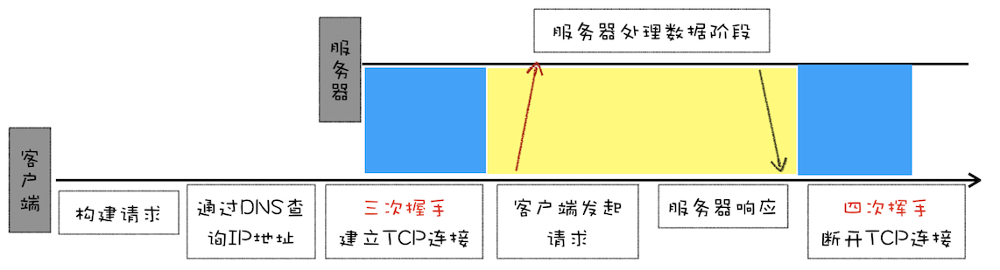
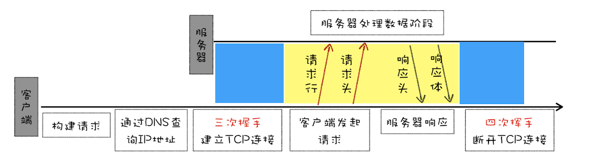

- [HTTP/1](#http1)
  - [HTTP/0.9 - 单行协议](#http09---单行协议)
  - [HTTP/1.0 - 构建可扩展性（多文件，状态码，用户代理）](#http10---构建可扩展性多文件状态码用户代理)
  - [HTTP1.1 - 标准化协议](#http11---标准化协议)
    - [请求方法](#请求方法)
    - [长链接](#长链接)
    - [管线化（并发连接 + 域名分片）](#管线化并发连接--域名分片)
      - [管线化](#管线化)
    - [提供虚拟主机的支持 - host请求头](#提供虚拟主机的支持---host请求头)
    - [支持响应分块 - 断点续传](#支持响应分块---断点续传)
      - [断点续传](#断点续传)
    - [以及其他HTTP/1.1特性（内容协商，缓存，cookie安全机制）](#以及其他http11特性内容协商缓存cookie安全机制)
    - [HTTP/1.1的瓶颈](#http11的瓶颈)
- [HTTP/2.0](#http20)
  - [二进制分帧 + 多路复用](#二进制分帧--多路复用)
  - [HTTP/2.0其他特性：设置请求优先级、服务器推送、头部压缩](#http20其他特性设置请求优先级服务器推送头部压缩)
- [HTTP/3.0](#http30)


> [HTTP 的发展(from MDN)
](https://developer.mozilla.org/zh-CN/docs/Web/HTTP/Basics_of_HTTP/Evolution_of_HTTP)

# HTTP/1
## HTTP/0.9 - 单行协议
HTTP/0.9 是于 1991 年提出的，主要用于学术交流，需求很简单——用来在网络之间传递 HTML 超文本的内容，所以被称为**超文本传输协议**。只能实现`GET`请求。

HTTP/0.9 的一个完整的请求流程如下：（可参考下图）

* 因为 HTTP 都是基于 TCP 协议的，所以客户端先要根据 **IP 地址**(DNS解析)、端口和服务器建立 TCP 连接，而建立连接的过程就是 `TCP 协议三次握手`的过程。
* 建立好连接之后，会发送一个 GET 请求行的信息，如GET /index.html用来获取 index.html。
* 服务器接收请求信息之后，读取对应的 HTML 文件，并将数据以 ASCII 字符流返回给客户端。
* HTML 文档传输完成后，断开连接。



**HTTP/0.9的特点:**
* 第一个是只有一个请求行，并**没有 HTTP 请求头和请求体**，因为只需要一个请求行就可以完整表达客户端的需求了。
* 第二个是服务器也**没有返回头信息**，这是因为服务器端并不需要告诉客户端太多信息，只需要返回数据就可以了。
* 第三个是返回的文件内容是以 **ASCII** 字符流来传输的，因为都是 HTML 格式的文件，所以使用 ASCII 字节码来传输是最合适的。

## HTTP/1.0 - 构建可扩展性（多文件，状态码，用户代理）
随着万维网的发展，在浏览器中展示的不单是 HTML 文件了，还包括了 JavaScript、CSS、图片、音频、视频等不同类型的文件。因此**支持多种类型的文件下载**是 HTTP/1.0 的一个`核心诉求`，而且文件格式不仅仅局限于 ASCII 编码，还有很多**其他类型编码的文件**。

HTTP/0.9 在建立好连接之后，只会发送类似GET /index.html的简单请求命令，并没有其他途径告诉服务器更多的信息，如文件编码、文件类型等。同样，服务器是直接返回数据给浏览器的，也没有其他途径告诉浏览器更多的关于服务器返回的文件信息。

所以在HTTP/1.0 引入了**请求头和响应头**，它们都是以为 Key-Value 形式保存的，在 HTTP 发送请求时，会带上请求头信息，服务器返回数据时，会先返回响应头信息。

**HTTP/1.0的请求过程如下：**


**HTTP/1.0 是怎么通过请求头和响应头来支持多种不同类型的数据呢？**

在发起请求时候会通过 HTTP 请求头告诉服务器它期待服务器返回什么类型的文件、采取什么形式的压缩、提供什么语言的文件以及文件的具体编码。最终发送出来的请求头内容如下：
```
accept: text/html // 客户端可以处理的内容类型
accept-encoding: gzip, deflate, br // 客户端能够理解的内容编码方式
accept-Charset: ISO-8859-1,utf-8 // 客户端可以处理的字符集类型
accept-language: zh-CN,zh // 客户端可以理解的自然语言
```

服务器接收到浏览器发送过来的请求头信息之后，会根据请求头的信息来准备响应数据。不过有时候会有一些意外情况发生，比如浏览器请求的压缩类型是 gzip，但是服务器不支持 gzip，只支持 br 压缩，那么它会通过响应头中的 content-encoding 字段告诉浏览器最终的压缩类型，也就是说最终浏览器需要根据响应头的信息来处理数据。下面是一段响应头的数据信息：
```
content-encoding: br
content-type: text/html; charset=UTF-8
```

**基于请求头和响应头，HTTP/1.0的特点如下:**
* 引入了**请求头和响应头**
* 对**多类型文件**提供良好的支持
* 引入了**状态码**，告诉浏览器服务器最终处理该请求的情况

## HTTP1.1 - 标准化协议

### 请求方法

http1.1 新增了很多请求方法，如` PUT、HEAD、OPTIONS `等。

### 长链接
长链接是指，在一个 TCP 连接上可以传输多个 HTTP 请求，只要浏览器或者服务器没有明确断开连接，那么该 TCP 连接会一直保持。

>目前浏览器中对于同一个域名，默认允许同时建立 `6` 个 TCP 持久连接。

在HTTP/1.0中默认使用短连接。从HTTP/1.1起，默认使用长连接

会在响应头加入这行代码：`Connection:keep-alive`

Keep-Alive不会永久保持连接，它有一个保持时间，可以在不同的服务器软件（如Apache）中设定这个时间。实现长连接需要客户端和服务端都支持长连接。

HTTP协议的长连接和短连接，实质上是TCP协议的长连接和短连接。
### 管线化（并发连接 + 域名分片）
允许在第一个应答被完全发送之前就发送第二个请求，以降低通信延迟。试图通过管线化的技术来解决**队头阻塞**的问题。

>**队头阻塞**问题：如果 TCP 通道中的某个请求因为某些原因没有及时返回，那么就会阻塞后面的所有请求

#### 管线化
* 在使用持久连接的情况下，某个连接上的消息传递类似于：
    * 请求1 --> 响应1 --> 请求2 --> 响应2 --> 请求3 --> 响应3
* 管线化的连接消息传递是类似于：
    * 请求1 --> 请求2 --> 请求3 --> 响应1 --> 响应2 --> 响应3
    * 相当于客户端**一次性把所有的请求打包**发送给服务端，同时服务端也一次性打包将所有的返回回传回来
    * 只有GET和HEAD请求可以进行管线化，而POST有所限制
    * 管线化是通过持久连接完成的，且只有http / 1.1 版本支持
### 提供虚拟主机的支持 - host请求头
HTTP/1.1 的请求头中增加了 `Host` 字段，用来表示当前的**域名地址**，这样服务器就可以根据不同的 Host 值做不同的处理。

### 支持响应分块 - 断点续传
引入 `Chunk transfer 机制(分块传输编码)`，实现大文件传输（**断点续传**）。服务器会将数据分割成若干个任意大小的数据块，每个数据块发送时会附上上个数据块的长度，最后使用一个零长度的块作为发送数据完成的标志。这样就提供了对动态内容的支持。

#### 断点续传
断点续传就是从文件上次`中断`的地方开始重新下载或上传。

**实现原理**
1. 将一个文件按照一定的规则人为的`分割`成多个小文件
2. 每次客户端上传文件片前先获取已上传的文件位置，确定本次应切割的位置
3. 每次上传完成后更新已上传文件大小的记录
4. 服务器接收到上传过来的小文件后根据一定的规则来组合这些小文件
5. 如果在上传过程中出现网络中断等意外情况，下次再次上传时可以从已经上传的部分继续上传，而不是重新上传。

**http中实现**

断点续传技术在http1.1中开始得到支持，通过在Header 里添加两个参数来实现的`Range`和`Content-Range`。
* `Range`用于`请求头`，指定本次请求上传或下载的第一个节点的位置和最后一个节点的位置，格式如下：
`Range:(unit=first byte pos)-[last byte pos]`
* `Content-Range`用于`响应头`，它描述了当前返回数据覆盖的范围和整个数据的长度。用于响应带有 Range 的请求。服务器会将 Content-Range 添加在响应的头部,格式如下：
`Content-Range:bytes 2048-4096/10240`
这里边 2048-4096 表示当前发送的数据范围， 10240 表示文件总大小。


> HTTP协议本身不支持断点上传，*需要自己实现*。

**举个🌰：**
1. 客户端下载一个1024K的文件，已经下载了其中512K
2. 网络中断，客户端请求续传，因此需要在HTTP头中申明本次需要续传的片段：
  `Range:bytes=512000-`
  这个头通知服务端从文件的512K位置开始传输文件
1. 服务端收到断点续传请求，从文件的512K位置开始传输，并且在HTTP头中增加：
  `Content-Range:bytes 512000-/1024000`
  这个头表示此次传输的文件是从512k位置开始直到最后结束，并且文件总大小是1024k
  并且此时服务端返回的HTTP状态码应该是`206`，而不是200。

### 以及其他HTTP/1.1特性（内容协商，缓存，cookie安全机制）
* 引入**内容协商机制**，包括语言、编码、类型等。并允许客户端和服务器之间约定以最合适的内容进行交换。
* 提供了 **缓存机制**，用来缓存已经下载过的数据，详见[《缓存-浏览器缓存》](./%E7%BC%93%E5%AD%98-%E6%B5%8F%E8%A7%88%E5%99%A8(http)%E7%BC%93%E5%AD%98(%E5%BC%BA%E7%BC%93%E5%AD%98%EF%BC%8C%E5%8D%8F%E5%95%86%E7%BC%93%E5%AD%98).md)
  - 强缓存
    - `Cache-Control(http 1.1)`的**优先级比Expires的优先级高**。表示资源缓存最大有效时间，在该时间内，客户端不需要向服务器发送请求。
    - `Expires(Http1.0)`是一个**绝对**时间，是缓存过期时间。
  - 协商缓存 
    - `Etag/If-None-match(http 1.1)`: 表示的是服务器资源的**唯一标识**，只要资源有变化，Etag就会重新生成；
    - `Last-Modified／If-Modified-since(http 1.0)`: 表示的是服务器的资源**最后一次修改的时间**；
* **客户端 Cookie、安全机制**
  - `Cookie`请求头: 表示客户端之前保存在本地的cookie内容


### HTTP/1.1的瓶颈
由于
1. TCP的慢启动，
2. 同时开启了多条 TCP 连接，那么这些连接会竞争固定的带宽
3. HTTP/1.1 队头阻塞的问题
会导致HTTP/1.1对**带宽的利用率却并不理想**。很难将带宽用满。


# HTTP/2.0
HTTP/2.0在HTTP/1.0的基础上，做了以下几点优化：
1. 多路复用
2. 设置请求优先级
3. 服务器推送
4. 头部压缩

## 二进制分帧 + 多路复用
**队头阻塞**，其根本原因在于HTTP 基于请求-响应的模型，在同一个 TCP 长连接中，前面的请求没有得到响应，后面的请求就会被阻塞。

HTTP1.1用`并发连接`和`域名分片`的方式来解决这个问题，但这并没有真正从 HTTP 本身的层面解决问题，只是增加了 TCP 连接。

为了解决该问题，HTTP/2.0使用了**多路复用机制**。

通信双方都可以给对方发送二进制帧，这种二进制帧的双向传输的序列，也叫做流(Stream)。HTTP/2 用流来在一个 TCP 连接上来进行多个数据帧的通信，这就是**多路复用**的概念。


HTTP/2 引入了`流`（stream）和`帧`（frame）的概念。
- 帧是最小的数据单位，HTTP 报文不再是原来的明文的 ASCII 编码，而是会被拆分成一个个的**二进制形式的帧**。帧上面除了 HTTP 数据，还包含数据长度、流标识符、帧类型等信息。

- 流是一个建立连接后的双向的虚拟字节流，可以承载多个消息。帧通过自己的**流 ID**，确定自己属于哪个报文，就可以不按顺序进行请求响应了。

- HTTP/2 会将所有 HTTP 请求打散成帧，在一个 TCP 连接上做**并发请求**，充分利用 TCP 带宽。现在浏览器对于 HTTP2，只会建立一个 TCP 连接，减轻了服务端不小压力。

<!-- **二进制分帧 + 多路复用**过程如下：
1. 首先，浏览器准备好请求数据，包括了请求行、请求头等信息，如果是 POST 方法，那么还要有请求体。
2. 这些数据经过二进制分帧层处理之后，会被转换为一个个带有请求 `ID` 编号的帧，通过协议栈将这些帧发送给服务器。所以这些帧是可以`交错传输`。
3. 服务器接收到所有帧之后，会将所有相同 ID 的帧合并为一条完整的请求信息。
4. 然后服务器处理该条请求，并将处理的响应行、响应头和响应体分别发送至二进制分帧层。
5. 同样，二进制分帧层会将这些响应数据转换为一个个带有请求 ID 编号的帧，经过协议栈发送给浏览器。
6. 浏览器接收到响应帧之后，会根据 ID 编号将帧的数据提交给对应的请求。 -->

**多路复用**是通过在协议栈中添加`二进制分帧层`来实现的，有了二进制分帧层还能够实现请求的**优先级、服务器推送、头部压缩**等特性，从而大大提升了文件传输效率。

## HTTP/2.0其他特性：设置请求优先级、服务器推送、头部压缩
1. **可以设置请求的优先级**：可以在发送请求时，标上该请求的优先级，这样服务器接收到请求之后，会优先处理优先级高的请求。
2. **服务器推送**：在 HTTP/2 当中，服务器已经不再是完全被动地接收请求，响应请求。当 TCP 连接建立之后，比如浏览器请求一个 HTML 文件，服务器就可以在返回 HTML 的基础上，将 HTML 中引用到的其他资源文件一起返回给客户端，减少客户端的等待。
3. **头部压缩**：HTTP/2 针对头部字段，也采用了对应的**压缩算法**——`HPACK`，对请求头进行压缩。
   * 在客户端和服务器端使用`哈希表`来跟踪和存储之前发送的键值对，对于相同的数据，不再通过每次请求和响应发送；
   * 首部表在HTTP/2的连接存续期内始终存在，由客户端和服务器共同渐进地更新；
   * 每个新的首部键值对要么被追加到当前表的末尾，要么替换表中之前的值。
    

>HTTP/2 在 2018 年就开始得到了大规模的应用。我接触的项目也都是2.0

# HTTP/3.0
虽然 HTTP/2 解决了应用层面的队头阻塞问题，不过和 HTTP/1.1 一样，HTTP/2 依然是基于 TCP 协议的，而 TCP 最初就是为了单连接而设计的。

如果在数据传输的过程中，有一个数据因为网络故障或者其他原因而丢包了，那么整个 TCP 的连接就会处于**暂停状态**，需要等待丢失的数据包被重新传输过来。把这种现象称为**TCP 上的队头阻塞。**

基于TCP协议对HTTP/2.0会面临以下问题：
1. TCP的队头阻塞
2. TCP建立连接的延时
3. TCP协议的僵化

所以为了解决以上问题，HTTP/3.0选择UDP协议，基于 UDP 实现了类似于 TCP 的多路数据流、传输可靠性等功能，我们把这套功能称为 `QUIC 协议`。关于 HTTP/2 和 HTTP/3 协议栈的比较，可以参考下图：


HTTP/3 中的 QUIC 协议集合了以下几点功能。
1. 实现了类似 **TCP 的流量控制、传输可靠性的功能**。虽然 UDP 不提供可靠性的传输，但 QUIC 在 UDP 的基础之上增加了一层来保证数据可靠性传输。它提供了数据包重传、拥塞控制以及其他一些 TCP 中存在的特性。
2. 集成了 **TLS 加密功能**。目前 QUIC 使用的是 TLS1.3，相较于早期版本 TLS1.3 有更多的优点，其中最重要的一点是减少了握手所花费的 RTT 个数。
3. 实现了 HTTP/2 中的**多路复用功能**。和 TCP 不同，QUIC 实现了在同一物理连接上可以有多个独立的逻辑数据流（如下图）。实现了数据流的单独传输，就解决了 TCP 中队头阻塞的问题。
4. 实现了**快速握手功能**。由于 QUIC 是基于 UDP 的，所以 QUIC 可以实现使用 0-RTT 或者 1-RTT 来建立连接，这意味着 QUIC 可以用最快的速度来发送和接收数据，这样可以大大提升首次打开页面的速度。

>2019年9月，HTTP/3支持已添加到Cloudflare和Google Chrome（Canary build）。Firefox Nightly在2019年秋季之后添加支持。[4]
>
>2022年6月6日，IETF正式标准化HTTP/3为RFC9114[5]。
