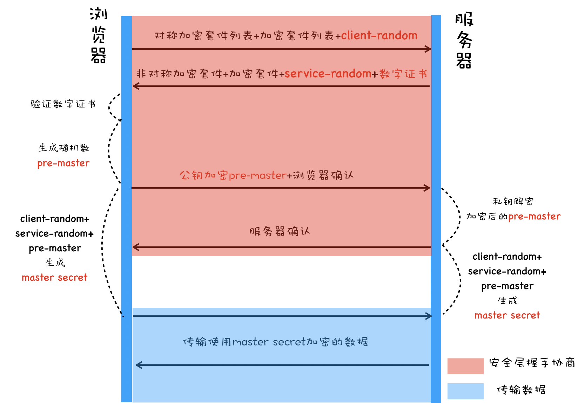

- [什么是HTTPS协议](#什么是https协议)
- [SSL/TLS](#ssltls)
- [https证书](#https证书)
- [HTTPS验证过程（对称加密 + 非对称加密 + 证书）](#https验证过程对称加密--非对称加密--证书)

>[参考链接](https://time.geekbang.org/column/article/156181?utm_term=zeusQYFJN&utm_source=app&utm_medium=geektime&utm_campaign=216-end&utm_content=v8zhuanlankaipianci0316)
# 什么是HTTPS协议
`HTTPS` 并非是一个新的协议，HTTPS是一种通过计算机网络进行安全通信的传输协议，经由`HTTP`进行通信，利用`SSL/TLS`建立全信道，加密数据包。HTTPS使用的主要作用是提供对网站服务器的身份认证，同时保护交换数据的隐私与完整性。

在 HTTPS 中，使用`传输层安全性(TLS)`或`安全套接字层(SSL)`对通信协议进行加密。也就是 HTTP + SSL(TLS) = HTTPS。

在 TCP 和 HTTP 之间插入一个安全层，所有经过安全层的数据都会被加密或者解密：

安全层有两个主要的职责：对发起 HTTP 请求的数据进行加密操作和对接收到 HTTP 的内容进行解密操作。

默认端口号是`443`

# SSL/TLS
SSL 即安全套接字层，它在 OSI 七层网络模型中处于第五层，SSL 在 1999 年被 IETF(互联网工程组)更名为 TLS ，即传输安全层，直到现在，TLS 一共出现过三个版本，1.1、1.2 和 1.3 ，目前最广泛使用的是 1.2.

TLS 用于两个通信应用程序之间提供保密性和数据完整性。TLS 由`记录协议、握手协议、警告协议、变更密码规范协议、扩展协议`等几个子协议组成，综合使用了`对称加密、非对称加密、身份认证`等许多密码学前沿技术.

>**对称加密**: 加密和解密的秘钥使用的是同一个.因此对称加密算法要保证安全性的话，密钥要做好保密，只能让使用的人知道，不能对外公开。
>
>**非对称加密**: 与对称加密算法不同，非对称加密算法需要两个密钥：公开密钥（publickey）和私有密钥（privatekey）。公钥进行`加密`，私钥进行`解密`。公开密钥可供任何人使用，私钥只有你自己能够知道。
>
>HTTPS中： `非对称加密`作用在`安全层握手协商阶段`（也就是红色部分）。`对称加密`作用在`传输数据`阶段。

# https证书
CA机构向浏览器开发商颁发CA证书，主要作用：
* 建立一个信息安全通道，来保证数据传输安全；防止数据泄露，
* 确认网站的真实性。

对于浏览器来说，数字证书有两个作用：
* 一个是通过数字证书向浏览器证明服务器的身份
* 另一个是数字证书里面包含了服务器公钥。

# HTTPS验证过程（对称加密 + 非对称加密 + 证书）

>HTTPS中： `非对称加密`作用在`安全层握手协商阶段`（也就是红色部分）。`对称加密`作用在`传输数据`阶段。

1. 第一步：浏览器发起hello
   
   浏览器向服务器发送以下内容：
   * `对称加密套件列表（客户端支持的SSL/TLS协议版本列表）`
   * `非对称加密套件（算法）列表`
   * 浏览器`随机数 client-random`；
2. 第二步：服务器回应Hello
   
   服务器**保存**浏览器随机数`client-random`，

   并向浏览器发送：
   * `对称加密套件`(SSL/TLS版本)
   * 选择双方都支持的最安全的`非对称加密算法`
   * 含有服务端的`公钥`的`证书`
   * 服务端生成的随机数`service-random`
3. 第三步：浏览器回应
   * 客户端收到后，检查证书是否合法，主要检查下面几点：1、证书是否过期 2、证书是否已经被吊销。3、证书是否可信。
   * 证书验证通过后，客户端生成随机数`pre-master`，然后利用`公钥`对 pre-master 加密，并向服务器发送加密后的数据；
4. 第四步：服务器最后的回应
    * 服务器使用`私钥`解密得到这个随机数`pre-master`。并返回确认消息。
  
到目前为止，服务器和浏览器就有了共同的 `client-random`、`service-random` 和 `pre-master`，然后服务器和浏览器会使用这三组随机数生成`对称密钥（master secret）`，因为服务器和浏览器使用同一套方法来生成密钥，所以最终生成的密钥也是相同的。

5. 第五步：采用`对称加密`的密钥(`master secret`)进行数据传输