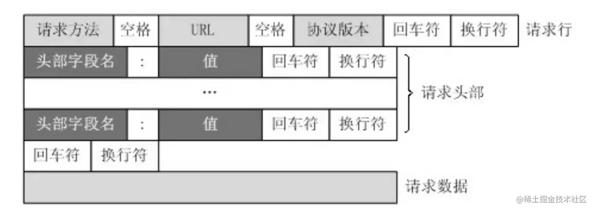
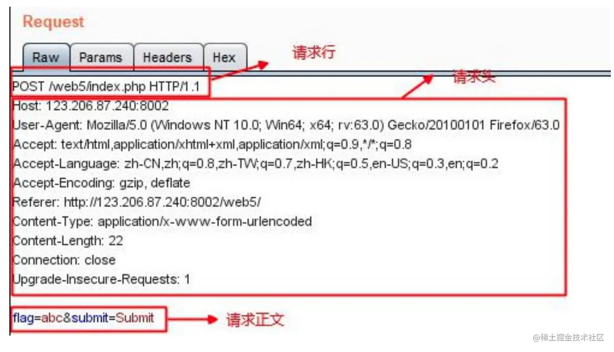
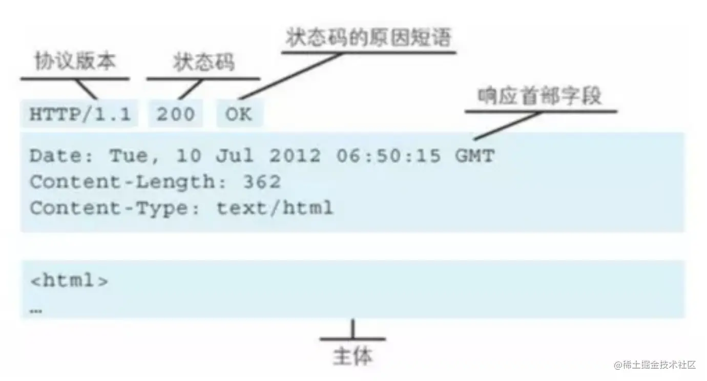

- [HTTP各种请求方法](#http各种请求方法)
- [GET和POST有什么区别？](#get和post有什么区别)
- [常见的HTTP请求头和响应头](#常见的http请求头和响应头)
- [HTTP状态码](#http状态码)
- [URL与URI](#url与uri)
- [http请求报文和响应报文](#http请求报文和响应报文)
- [http请求和rpc请求的区别？如何转换？](#http请求和rpc请求的区别如何转换)

# HTTP各种请求方法
http/1.1规定了以下请求方法(注意，都是大写):
* GET: 通常用来获取资源
* HEAD: 获取资源的元信息
* POST: 提交数据，即上传数据
* PUT: 修改数据
* DELETE: 删除资源(几乎用不到)
* CONNECT: 建立连接隧道，用于代理服务器
* OPTIONS: 判断是否有请求权限，用来跨域请求
* TRACE: 追踪请求-响应的传输路径

# GET和POST有什么区别？
* 从`缓存`的角度，GET 请求会被浏览器主动**缓存**下来，留下历史记录，而 POST 默认不会。
* 从`参数`的角度，GET 一般放在 URL 中，因此不安全，POST 放在请求体中，支持更多的数据类型。
* 从`TCP（本质区别）`的角度，GET 请求会把请求报文一次性发出去，而 POST 会分为两个 TCP 数据包，首先发 header 部分，如果服务器响应 100(continue)， 然后发 body 部分。(火狐浏览器除外，它的 POST 请求只发一个 TCP 包)这会导致在传输层中出现两次TCP连接，对于TCP来说，通信次数越多可靠性越低，能在一次连接中传输完需要的消息是最可靠的。
* 从`传输数据大小`的角度，GET提交的数据大小有限制（注意：Http Get方法提交的数据大小长度并没有限制，HTTP协议规范没有对URL长度进行限制，这个限制是特定的浏览器及服务器对它的限制）；POST方法提交的数据没有限制
* 从`编码`的角度，GET 只能进行 URL 编码，只能接收 ASCII 字符，而 POST 没有限制。
#  常见的HTTP请求头和响应头

**请求头**

- `Accept`: 表示客户端可以处理的媒体类型。
- `Authorization`: 表示客户端发起此请求的身份验证信息。
- `Content-Type`: 表示请求体中包含的媒体类型。`text/html;charset=UTF-8`
- `Connection`: 
  - `keep-alive`: TCP连接不会关闭，
  - `close` 代表一个Request完成后，客户端和服务器之间用于传输HTTP数据的TCP连接会关闭， 当客户端再次发送Request，需要重新建立TCP连接。
- `User-Agent`: 表示发起请求的客户端应用程序的类型、版本和操作系统。
- `Cache-Control`: **缓存相关**，
  - `private`(默认值)：代表只有发起请求的浏览器才可以进行缓存。
  - `no-cache`：可以在本地进行缓存，但每次发请求时，都要向服务器进行验证，如果服务器允许，才能使用本地缓存。(**协商缓存验证**)
  - `max-age`：指定响应的最大缓存时间（单位为秒）。在这段时间内，浏览器可以使用缓存的响应。
  - `no-store`：禁止浏览器缓存响应内容，每次都需要重新请求。
  - `public`：代表 http 请求返回的内容所经过的任何路径当中（包括中间一些http代理服务器以及发出请求的客户端浏览器），都可以对返回内容进行缓存操作。
  - `must-revalidate`：响应在特定条件下会被重用，以满足接下来的请求，但是它必须到服务器端去验证它是不是仍然是最新的。
  >**no-cache 和 no-store 的区别**:
  >- `no-store`：永远都不要在客户端存储资源，永远都去原始服务器去获取资源。
  >- `no-cache`：可以在客户端存储资源，每次都必须去服务端做新鲜度校验，也就是所谓的协商缓存。
- `Cookie`: 表示客户端之前保存在本地的cookie内容
- `Range`: **http1.1/断点续传**，值定本次请求上传或下载的第一个节点的位置和最后一个节点的位置，格式如下：
`Range:(unit=first byte pos)-[last byte pos]`

**响应头**

- `Access-Control-Allow-Origin`: 表示**跨域请求**时允许访问的域名。
- `Content-Type`: 表示响应体中包含的媒体类型。`text/html;charset=UTF-8`
- `Content-Length`: 表示响应体中的数据长度。
- `Set-Cookie`: 表示服务器要求客户端更新本地的cookie内容。
- `Access-Control-Allow-Credentials`：该字段可选。它的值是一个布尔值，表示是否允许发送`Cookie`。默认情况下，Cookie不包括在**CORS请求**之中。
-  `Content-Range`: **断点续传**，它描述了当前返回数据覆盖的范围和整个数据的长度。用于响应带有 Range 的请求。服务器会将 Content-Range 添加在响应的头部,格式如下：
`Content-Range:bytes 2048-4096/10240`
这里边 2048-4096 表示当前发送的数据范围， 10240 表示文件总大小。
- `Cache-Control`: 指示客户端应该如何缓存响应数据。与请求头相同。**强缓存**
- `Expires`: `Expires:Sun, 1 Jan 2000 01:00:00 GMT`，告诉客户端在这个时间前，可以直接访问缓存副本。**强缓存**。
  问题：客户端和服务器的时间不一定会都是相同的
  解决：`Cache-Control：max-age=*`这个响应头更为准确的
- `Etag`: **协商缓存**。是上一次加载资源时，服务器返回的当前资源文件的一个**唯一标识**。它的作用是用来标识资源是否有变化。
  - 下一次请求相同的资源时，浏览器会从自己的缓存中找出“不确定是否过期的”缓存，因此在请求头中将上次的Last-Modified的值写入到请求头的`If-Modified-since`字段
  - 服务器会将If-Modified-since的值与**服务器中这个资源的最后修改时间**进行对比。如果没有变化，这表示未修改，响应304和空响应体，直接从缓存中读取；如果If-Modified-since**小于**最后修改时间，则表示修改了，响应 200 状态码，并返回数据
- `Last-Modified`: **协商缓存**。表示资源最后一次被修改的时间。
  - 浏览器在下一次发起请求时，会将上一次返回的Etag值赋值给`If-None-Match`并添加在 请求 Header 中。服务端匹配传入的值与上次是否一致，如果一致返回`304`，浏览器则读取本地缓存；否则返回`200和更新后的资源及新的Etag`

# HTTP状态码
**1xx - 信息提示**
* 101 - 切换协议，服务器根据客户端的请求切换协议。

**2xx - 成功**
* 200 - ok，请求已成功被服务器接收、理解、并接受
* `204` - 服务器成功处理了请求，但没返回任何内容。（`跨域预检请求`返回的响应代码）
* `206` - 服务器已经成功处理了`部分` GET 请求。类似于 FlashGet 或者迅雷这类的 HTTP下载工具都是使用此类响应实现`断点续传`或者将一个大文档分解为多个下载段同时下载。

**3xx - 重定向**
* `304` - 如果客户端发送了一个带条件的 GET 请求且该请求已被允许，而文档的内容（自上次访问以来或者根据请求的条件）并没有改变，则服务器应当返回这个状态码。（涉及到`协商缓存`）
  
**4xx - 客户端错误**

**5xx - 服务器错误**
* 502 - 服务器上的一个`错误网关` ，因此说它是无效的
* 503 - `服务不可用`，服务器由于维护或者负载过重未能应答。
* 504 - `网关超时`，由作为代理或网关的服务器使用，表示不能及时地从远程服务器获得应答。

# URL与URI
* URL是一种**具体**的URI，它是URI的一个子集，它不仅唯一标识资源，而且还提供了定位该资源的信息。
* URI 是一种语义上的**抽象概念**，可以是绝对的，也可以是相对的，而URL则必须提供足够的信息来定位，是绝对的。

# http请求报文和响应报文

**请求报⽂**
- 请求⾏
- 请求头部
- 空⾏
- 请求体

**请求报⽂**
- 响应⾏
- 响应头
- 空⾏
- 响应体

# http请求和rpc请求的区别？如何转换？

https://www.xiaolincoding.com/network/2_http/http_rpc.html#%E6%9C%8D%E5%8A%A1%E5%8F%91%E7%8E%B0