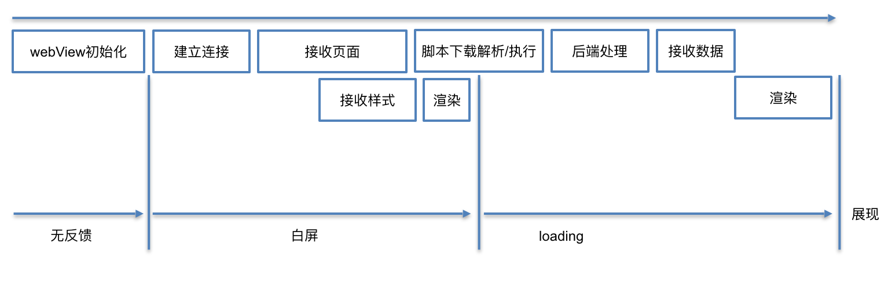
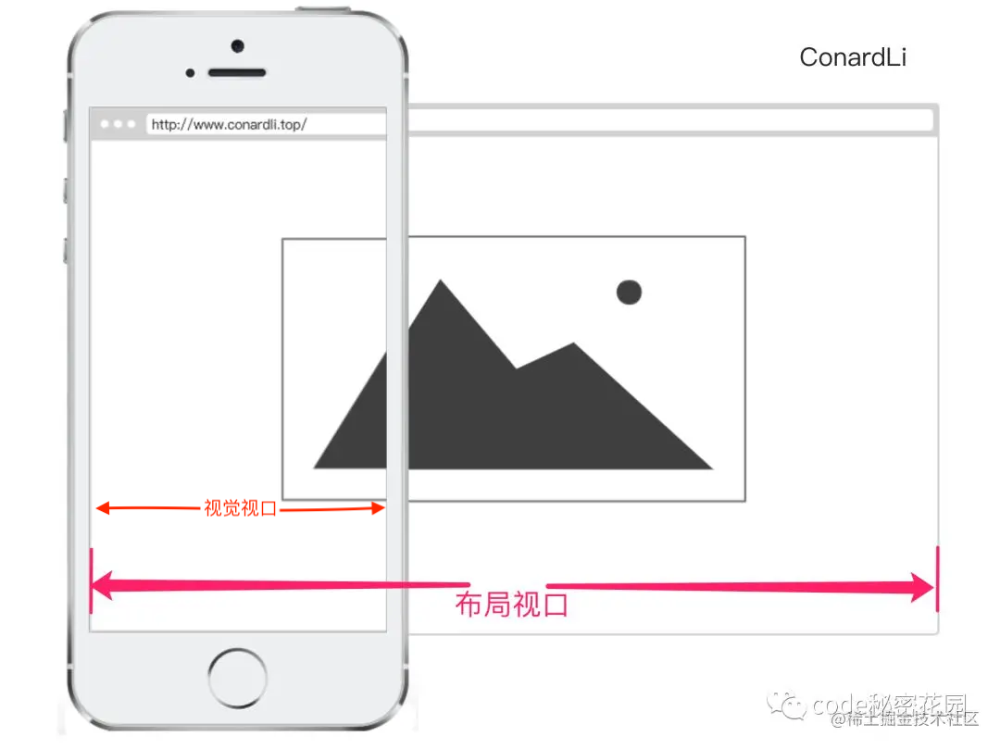

- [移动端开发模式](#移动端开发模式)
- [移动端开发需要学习的点](#移动端开发需要学习的点)
  - [Vue或React框架](#vue或react框架)
  - [webview](#webview)
    - [简介](#简介)
      - [webview是什么？](#webview是什么)
      - [作用](#作用)
      - [原生应用调用html页面的过程？](#原生应用调用html页面的过程)
      - [webview优势](#webview优势)
    - [webview启动过程、及各个阶段的性能与优化](#webview启动过程及各个阶段的性能与优化)
  - [js bridge原理](#js-bridge原理)
    - [URL Scheme](#url-scheme)
    - [js调用native](#js调用native)
    - [native调用JS](#native调用js)
    - [JS Bridge设计](#js-bridge设计)
  - [移动端兼容问题](#移动端兼容问题)
    - [1px边框问题](#1px边框问题)
    - [点击穿透问题](#点击穿透问题)
    - [300ms延迟问题](#300ms延迟问题)
  - [移动端屏幕适配](#移动端屏幕适配)
    - [媒体查询方案](#媒体查询方案)
    - [动态rem方案](#动态rem方案)
    - [Viewport方案](#viewport方案)
  - [虚拟键盘](#虚拟键盘)
  - [移动端开发调试与抓包](#移动端开发调试与抓包)
  - [APP套壳开发模式](#app套壳开发模式)
  - [移动端网络请求](#移动端网络请求)

# 移动端开发模式
分三种：纯原生（Native App）、网页应用（Web App）、混合开发（Hybird App）。
- **原生（Native App）**：就是我们熟知的安卓、ios
  - 缺点：学习成本高，业务代码写两套
- **网页应用（Web App）**：Web App 就是借助于前端 HTML5 技术实现的在浏览器里面跑的 App，简单来说就是一个 Web 网站。因为是在浏览器里面运行，所以天然支持跨平台，一套代码甚至很容易支持移动端和 PC 端不需要安装到手机里面，上线发版也比较容易。
  - 缺点：只能使用浏览器提供的功能，安卓和ios的很多原生能力无法实现，比如摄像头
- **混合开发（Hybird App）**：简单来说 Hybrid 就是套壳 App，整个 App 还是原生的，也需要下载安装到手机，但是 App 里面打开的页面既可以是 Web 的，又可以是原生的。`H5`页面（h5指的是静态页面，包含了html+js+css，可以用vue或react开发的页面）会跑在 Native 的一个叫做 `WebView` 的容器里面。同时可以使用`js bridge`（js与原生之间的桥接）来调用系统的原生能力，比如摄像头、相册等功能，功能就不仅仅局限于浏览器了。
  - 优点：套代码可以很容易跨iOS、安卓、Web、小程序、快应用多个平台。
  - 缺点：
  

# 移动端开发需要学习的点

## Vue或React框架

选择你熟悉的框架，并学习其核心概念、语法和组件化开发方式。这将帮助你搭建可复用的页面组件，并更好地管理应用的状态和路由。

详见《前端框架》文件夹

## webview

### 简介
#### webview是什么？
Webview 是一个基于`webkit`内核的引擎，可以**解析DOM 元素，展示html页面的控件**，它和浏览器展示页面的原理是相同的，所以可以把它当做浏览器看待。

`WebKit `诞生于苹果发布的 Safari 浏览器。后来谷歌基于 WebKit 创建了 Chromium 项目，在此基础上发布了我们熟悉的 Chrome 浏览器。


**webview是实现混合开发的关键之一**

安卓（Android）：SDK 中有WebView控件；

苹果（IOS，MacOS）：WebView/UIWebView/WKWebView(UIView/NSView)；。

#### 作用
电脑上展示html页面，通过浏览器打开页面即可浏览，而手机系统层面，如果没有webview支持，是无法展示html页面，所以webview的作用即**用于手机系统来展示html界面的**

可和**JavaScript交互调用**

还可以对url请求、页面加载、渲染、页面交互进行强大的处理。

在安卓上 webview底层引擎是 `v8`，在ios上面，底层引擎是`js core`，但也与v8类似。
#### 原生应用调用html页面的过程？
1. 原生应用**加载**html页面（加载页面的方式可能有多种，比如加载本地写好的html文件，或者放置在服务器的文件）

2. 加载完成，**展示**就是通过webview来渲染展示的，如果系统没有webview，则是无法渲染展示html的

3. **交互**，2步其实一个原生应用调用html页面过程已经完成了，那么页面不光展示，有时候可能还需要交互，这里的话就需要写一些方法(`js bridge`)了，比如html界面的按钮需要调用**系统原生**的东西（比如：拍照，系统的文件，相册之类的）。原生端就负责维护html调用的接口，然后按照需要返回（原生端充当一个server的角色，html充当一个client角色）

#### webview优势

能以较低的成本实现Android、iOS和Web的复用，也可以冠冕堂皇的突破苹果对热更新的封锁

### webview启动过程、及各个阶段的性能与优化
> https://tech.meituan.com/2017/06/09/webviewperf.html

webview启动过程大概分为以下几个阶段：


**为什么webview会很慢？**
在浏览器中，我们输入地址时（甚至在之前），浏览器就可以开始加载页面。 而在客户端中，客户端需要**先花费时间初始化WebView完成**后，才开始加载。

**优化建议总结**
- **初始化阶段**：
  - **全局webview**：在客户端刚启动时，就初始化一个全局的WebView待用，并隐藏；当用户访问了WebView时，直接使用这个WebView加载对应网页，并展示。
    - 缺点：额外的内存消耗
  - **客户端代理数据请求**（腾讯）：在客户端初始化WebView的同时，直接由native开始网络请求数据；当页面初始化完成后，向native获取其代理请求的数据。
- **建立连接/服务器处理**
  - 后端处理慢，可以让服务器分trunk输出，在后端计算的同时前端也加载网络静态资源。
  - 合理的预加载、预缓存可以让加载速度的瓶颈更小。
- **页面框架渲染**：参照雅虎14条
  1. 尽可能的减少http请求数
  2. 使用CDN（内容分发网络）
  3. 添加Expire/Cache-Control头
  4. 启用Gzip压缩
  5. 将css放在页面最上面
  6. 将script放在页面最下面
  7. 避免在CSS中使用Expressions
  8. 把js和css文件放到外部文件中
  9. 减少DNS查询
  10. 压缩JavaScript和Css
  11. 避免重定向
  12. 移除重复的脚步
  13. 配置实体标签（ETag）
  14. 使用Ajax缓存


## js bridge原理
>https://juejin.cn/post/6916316666208976904

**js bridge是实现混合开发的另一关键**，它实现了h5与native的通信

在 JS 和 Native 通信的时候往往要经过 `Bridge`，这一步是**异步**的。

对于JS Bridge来说，使用简单应该包括三个端：`Android、IOS、 JavaScript`

一般分为 JS 调用 Native 和 Native 主动调用 JS 两种形式。

### URL Scheme
URL Scheme是App提供给外部的可以直接操作App的规则。 是一种特殊的 URL，一般用于在 Web 端唤醒 App，甚至跳转到 App 的某个页面，比如在某个手机网站上付款的时候，可以直接拉起支付宝支付页面。

比如，你可以在浏览器里面直接输入 `weixin://`，系统就会提示你是否要打开微信。输入 `mqq://` 就会帮你唤起手机 QQ。`weixin://`就是属于自定义scheme

通常情况下，App 安装后会在**手机系统**上注册一个 Scheme
- 一般在 Android 里面需要到 AndroidManifest.xml 文件中去注册
-  iOS 需要在 Xcode 里面注册

### js调用native

JS 调用 Native 通信大致有三种方法：

- **拦截 Scheme**
  仔细思考一下，如果是 JS 和 Java 之间传递数据，我们该怎么做呢？ 对于前端开发来说，调 Ajax 请求接口是最常见的需求了。不管对方是 Java 还是 Python，我们都可以通过 http/https 接口来获取数据
  已知**客户端是可以拦截请求**的，那么可不可以在这个上面做文章呢？

  如果我们请求一个不存在的地址，上面带了一些参数，通过参数告诉客户端我们需要调用的功能呢？

  现在主流的方式是`自定义 Scheme 协议`，以这个为通信标识，域名和路径当做指令。
- **注入 JS 上下文**：原理是，通过 WebView 提供的接口，向 JavaScript 的 Context（window）中注入对象或者方法，让 JavaScript 调用时，直接执行相应的 Native 代码逻辑，达到 JavaScript 调用 Native 的目的。
  - 在 **iOS** 中内置了 `JavaScriptCore` 这个框架，可以实现执行 JS 以及注入 Native 对象等功能。
  这种方式不依赖拦截，主要是通过 WebView 向 JS 的上下文注入对象和方法，可以让 JS 直接调用原生。
  - **安卓**4.2之前注入 JS 一般是使用 `addJavascriptInterface `，Android4.2 之后提供了 `@JavascriptInterface` 注解，暴露给 JS 的方法必须要带上这个。
- **弹窗拦截**
  - 这种方式是利用弹窗会触发 `WebView` 相应事件来拦截的。
### native调用JS

Native 调用 JS 一般就是直接 JS 代码字符串，有些类似我们调用 JS 中的 eval 去执行一串代码。一般有 loadUrl、evaluateJavascript 等几种方法，这里逐一介绍。
但是不管哪种方式，客户端能拿到挂载到 **window 对象上面的属性和方法**。

Native 调用 JS 比较简单，只要 H5 端将 JS 方法暴露在 Window 上给 Native 调用即可。


### JS Bridge设计
一般各个公司都有自己的JS Bridge库。

在 JSBridge 的设计中，可以把前端看做 RPC 的客户端，把 Native 端看做 RPC 的服务器端，从而 JSBridge 要实现的主要逻辑就出现了：**通信调用（Native 与 JS 通信） 和 句柄解析调用**。(nodejs中进程间通信也用到了**句柄**)

JSBridge 的接口主要功能有两个：调用 Native（给 Native 发消息） 和 接被 Native 调用（接收 Native 消息）。因此，JSBridge（为JavaScript 端的 JSBridge 的实现） 可以设计如下：

```js
(function () {
    var id = 0,
        callbacks = {};

    window.JSBridge = {
        // 调用 Native
        invoke: function(bridgeName, callback, data) {
            // 判断环境，获取不同的 nativeBridge
            var thisId = id ++; // 获取唯一 id
            callbacks[thisId] = callback; // 存储 Callback
            nativeBridge.postMessage({
                bridgeName: bridgeName,
                data: data || {},
                callbackId: thisId // 传到 Native 端
            });
        },
        receiveMessage: function(msg) {
            var bridgeName = msg.bridgeName,
                data = msg.data || {},
                callbackId = msg.callbackId; // Native 将 callbackId 原封不动传回
            // 具体逻辑
            // bridgeName 和 callbackId 不会同时存在
            if (callbackId) {
                if (callbacks[callbackId]) { // 找到相应句柄
                    callbacks[callbackId](msg.data); // 执行调用
                }
            } elseif (bridgeName) {

            }
        }
    };
})();
```


## 移动端兼容问题
### 1px边框问题
**问题表现**：在高清屏下，移动端的1px 会很粗。

**产生原因**：主要是跟一个东西有关，**DPR(devicePixelRatio) 设备像素比**，它是默认缩放为100%的情况下，**设备像素和CSS像素**的比值。
`window.devicePixelRatio=物理像素 /CSS像素`

目前主流的屏幕DPR=2 （iPhone 8）,或者3 （iPhone 8 Plus）。拿2倍屏来说，设备的物理像素要实现1像素，而DPR=2，所以css 像素只能是 0.5。

**解决方案**：
- 背景图片
- 结合媒体查询（@media）+ transform: scale(0.5)缩放解决不同 dpr 值屏幕的边框问题。
- `viewport+rem+js` ：viewport是设备的屏幕上能用来显示我们的网页的那一块区域。viewport有以下属性
  - width：控制 viewport 的大小，可以指定的一个值，如 600，或者特殊的值，如 device-width 为设备的宽度（单位为缩放为 100% 时的 CSS 的像素）。
  - height：和 width 相对应，指定高度。
  - initial-scale：初始缩放比例，也即是当页面第一次 load 的时候缩放比例。
  - maximum-scale：允许用户缩放到的最大比例。
  - minimum-scale：允许用户缩放到的最小比例。
  - user-scalable：用户是否可以手动缩放。
  ```html
  <html>
    <head>
        <title>1px question</title>
        <meta http-equiv="Content-Type" content="text/html;charset=UTF-8">
        <meta name="viewport" id="WebViewport"  content="initial-scale=1,maximum-scale=1,   minimum-scale=1,user-scalable=no">        
        <style>
            html {
                font-size: 1px;
            } 
            .a,.b {
                box-sizing: border-box;
                margin-top: 1rem;
                padding: 1rem;                
                font-size: 1.4rem;
            }
        </style>
        <script>
            var viewport = document.querySelector("meta [name=viewport]");
            //下面是根据设备像素设置viewport
            if (window.devicePixelRatio == 1) {
                viewport.setAttribute('content',  'width=device-width,initial-scale=1,   maximum-scale=1, minimum-scale=1,   user-scalable=no');
            }
            if (window.devicePixelRatio == 2) {
                viewport.setAttribute('content',  'width=device-width,initial-scale=0.5,   maximum-scale=0.5, minimum-scale=0.5,   user-scalable=no');
            }
            if (window.devicePixelRatio == 3) {
                viewport.setAttribute('content',  'width=device-width,initial-scale=0. 3333333333333333, maximum-scale=0. 3333333333333333, minimum-scale=0. 3333333333333333, user-scalable=no');
            }
            var docEl = document.documentElement;
            var fontsize = 32* (docEl.clientWidth / 750) +  'px';
            docEl.style.fontSize = fontsize;
        </script>
    </head>
    <body>
        <div class="top_b a">下面的底边宽度是虚拟1像素的</div>
        <div class="b">上面的边框宽度是虚拟1像素的</div>
    </body>
  </html>
  ```
### 点击穿透问题

**什么叫点击穿透**：是指触发某个目标元素的触摸事件时，会同时触发该目标元素相同位置中其他元素的鼠标点击事件。

**常见的事件穿透场景：**

- 目标元素触发触摸事件时隐藏或移除自身，对应位置元素触发 click 事件或 a 链接跳转。
- 目标元素使用触摸事件跳转至新页面，新页面中对应位置元素触发 click 事件或 a 链接跳转。

**产生原因**：
事件触发的先后顺序是：touch -> click。正是由于这种 click 事件的滞后性设计为事件穿透（点击穿透）埋下了伏笔。


**解决办法**
- **禁用click事件**，既然是开发移动端事件,那就不要用 click, 全部用 touch 事件
- `fastclick`库，其实现思路是，取消 click 事件（参看源码 164-173 行），用 touchend 模拟快速点击行为。从此所有点击事件都使用click，不会出现“穿透”的问题，并且没有300ms的延迟。

### 300ms延迟问题
**产生原因：**
针对小屏幕浏览桌面端站点有一个**双击缩放**的功能，这就是产生300ms延迟的主要原因。因此，只有等待300ms了之后，才能判断是双击和长按事件，才会触发click事件。

**解决方法**
- **禁用缩放**，viewport的user-scalable属性：用户是否可以手动缩放。`<meta name="viewport" content="user-scalable=no">`
- **更改默认的视口宽度**，`<meta name="viewport" content="width=device-width"/>`将视口宽度设置为设备屏幕宽度，那么网站就不需要缩放了
- `touch-action：none`，表示在该元素上操作不会触发用户代理（浏览器）的任何默认行为。就无需进行300ms的延迟判断了。
- `FastClick`，检测到touchend事件的时候，会通过DOM自定义事件立即出发模拟一个click事件，并把浏览器在300ms之后真正的click事件阻止掉。


## 移动端屏幕适配

了解移动端适配的基本原理和常用技术，如rem、vw/vh、媒体查询和flex布局等。这将确保你的H5页面在不同移动设备上获得良好的显示效果。

**硬件概念：**
- 屏幕分辨率（物理分辨率、设备分辨率）
  以 iPhone6 为例，其屏幕分辨率为 750 x 1334，指的是屏幕水平有 750 个像素点，垂直有 1334 个像素点。
- 设备像素（物理像素）
  设备像素（Device Pixels）是显示设备中一个最微小的物理部件，和上面所讲的设备分辨率相对应。
- 像素密度（Pixels Per Inch）
  以 iPhone6 为例，其屏幕像素密度为 326ppi，指的是每英寸有 326 个像素点。
**浏览器中的概念：**
- 设备像素比（DPR）
  是**设备像素和CSS像素**的比值
- 视口：视口的概念通常用于移动端。一般我们所说的视口共包括三种：布局视口、视觉视口和理想视口
  可用用`document.documentElement.clientWidth/clientHeight` 来获取布局视口大小
  可用`window.innerWidth/innerHeight` 来获取视觉视口大小。
  

### 媒体查询方案
通过 CSS 的 @media 媒体查询设置不同的 style。通过媒体查询，我们可以根据不同屏幕设置不同样式，这样就可以实现不同屏幕的适配。

link 元素中的 CSS 媒体查询，不同屏幕加载不同样式文件：
```html
<link rel="stylesheet" media="(max-width: 500px)" href="mobile.css" />
<link rel="stylesheet" media="(min-width: 980px)" href="pc.css" />
```

CSS 样式表中的媒体查询：
```css
@media only screen and (max-width: 414px){
  html{
    font-size: 64px;
  }
}
@media only screen and (max-width: 375px){
  html{
    font-size: 58px;
  }
}
@media only screen and (max-width: 360px){
  html{
    font-size: 56px;
  }
}
@media only screen and (max-width: 320px){
  html{
    font-size: 50px;
  }
}
```

### 动态rem方案
CSS 中的一个相对长度单位 `rem`，其大小由**根元素字体大小决定**。

对于不同屏幕，我们只需要动态修改根元素字体大小，元素大小就会同比例改变，从而做到页面的自动适配效果。

例如，假设设计稿宽度为 750px，元素A宽度为 300px，在屏幕宽度为 375pt 的屏幕中，设置根元素字体大小为 37.5px，则元素A宽度为 4rem；在屏幕宽度为 750pt 的屏幕中，只需将根元素字体大小改为 75px，不需要改变元素A的大小，就可以做到页面适配。

```js
(function flexible (window, document) {
  var docEl = document.documentElement
  
 	// 根据屏幕宽度设置根元素字体大小，set 1rem = viewWidth / 10
  function setRemUnit () {
    var rem = docEl.clientWidth / 10
    docEl.style.fontSize = rem + 'px'
  }

  setRemUnit()

  // reset rem unit on page resize
  window.addEventListener('resize', setRemUnit)
  window.addEventListener('pageshow', function (e) {
    if (e.persisted) {
      setRemUnit()
    }
  })
}(window, document))
```
有`postcss-px2rem`这样的小工具帮助计算px转换为rem单位
```css
.selector {
    width: 150px;
    height: 64px; /*px*/
    font-size: 28px; /*px*/
    border: 1px solid #ddd; /*no*/
}
```
转换后
```css
.selector {
    width: 2rem;
    border: 1px solid #ddd;
}
[data-dpr="1"] .selector {
    height: 32px;
    font-size: 14px;
}
[data-dpr="2"] .selector {
    height: 64px;
    font-size: 28px;
}
[data-dpr="3"] .selector {
    height: 96px;
    font-size: 42px;
}
```

### Viewport方案
CSS Viewport units （视口单位）正是一种相对于屏幕宽高的一种长度单位，并且兼容性越来越好。视口单位有：`vw、vh、vmin和vmax`。**vw 单位表示根元素宽度的百分比，1vw 等于视口宽度的1%**。

vw 适配方案的流程：

- meta 标签设置 viewport 宽度为屏幕宽度；
- 开发环境配置 postcss-px-to-viewport 或者类似插件；
- 根据设计稿写样式，元素宽高直接取设计稿宽高即可，单位为 px，插件会将其转换为 vw；
- 段落文本也按照设计稿写，单位为px，不需要转换为 vw；


## 虚拟键盘

## 移动端开发调试与抓包


抓包工具：`whistle`和`charles`

## APP套壳开发模式

即**原生的壳+H5**，用原生的app写个基本的启动界面，加上一个WebView，然后用webview去加载所有的app的内容，即一堆的HTML+CSS+JS，从而实现app的效果。

## 移动端网络请求
与正常的web应该开发一样，详见《浏览器》文件夹


