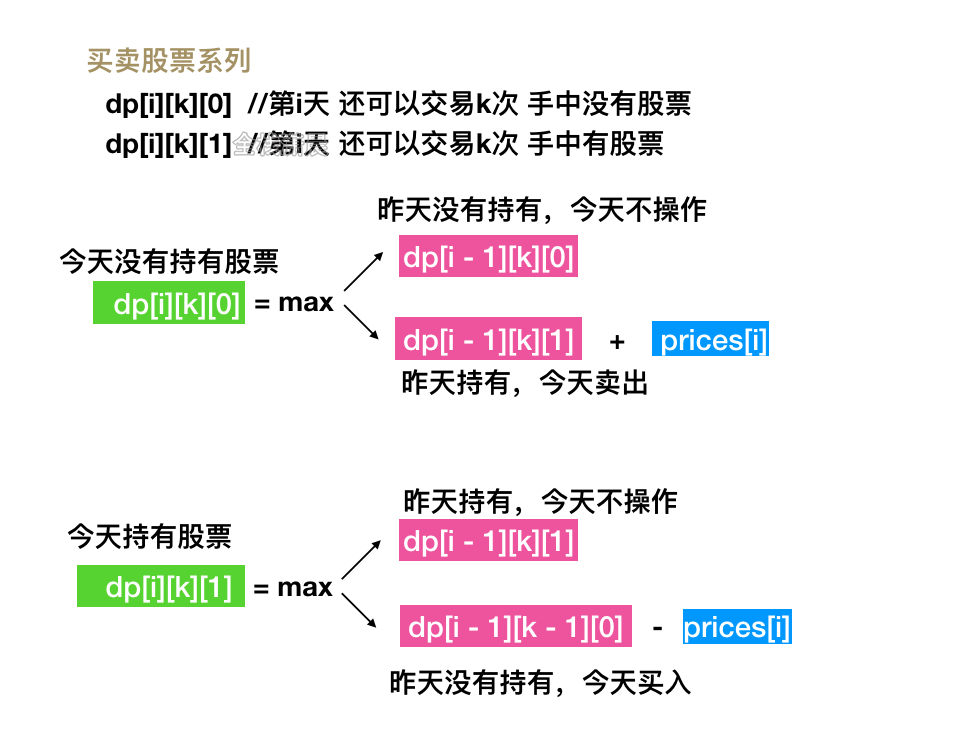

### 限制条件
* 先买入才能卖出
* 不能同时参加多笔交易，再次买入时，需要先卖出
* k >= 0才能进行交易，否则没有交易次数

### 定义操作
* 买入
* 卖出
* 不操作

### 定义状态
* i: 天数
* k: 交易次数，每次交易包含买入和卖出，这里我们只在买入的时候需要将 k - 1
* 0: 不持有股票
* 1: 持有股票

### 举例
```js
  dp[i][k][0]//第i天 还可以交易k次 手中没有股票
  dp[i][k][1]//第i天 还可以交易k次 手中有股票
```
最终的最大收益是`dp[n - 1][k][0]而不是dp[n - 1][k][1]`，因为最后一天卖出肯定比持有收益更高

### 状态转移方程
```js
// 今天没有持有股票，分为两种情况：
// 1. dp[i - 1][k][0]，昨天没有持有，今天不操作。 
// 2. dp[i - 1][k][1] + prices[i] 昨天持有，今天卖出，今天手中就没有股票了。
dp[i][k][0] = Math.max(dp[i - 1][k][0], dp[i - 1][k][1] + prices[i])


// 今天持有股票，分为两种情况：
// 1.dp[i - 1][k][1] 昨天持有，今天不操作
// 2.dp[i - 1][k - 1][0] - prices[i] 昨天没有持有，今天买入。
dp[i][k][1] = Math.max(dp[i - 1][k][1], dp[i - 1][k - 1][0] - prices[i])

//最大利润就是这俩种情况的最大值
```

leetcode例题：

121、买卖股票的最佳时机（easy）限定交易次数 k=1

122、买卖股票的最佳时机 II（medium）交易次数无限制 k = +infinity

123、买卖股票的最佳时机 III (hrad) 限定交易次数 k=2

188、买卖股票的最佳时机 IV (hard) 限定交易次数 最多次数为 k

309、最佳买卖股票时机含冷冻期(medium) 含有交易冷冻期

714、买卖股票的最佳时机含手续费 (medium) 每次交易含手续费