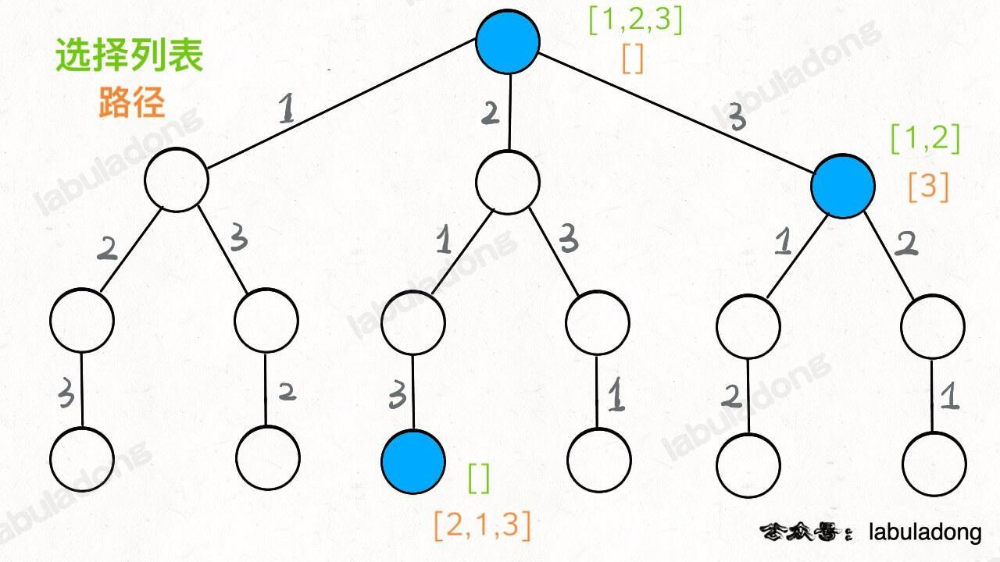
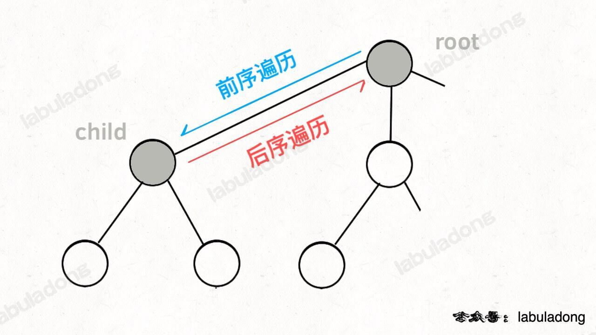

[回溯算法解题套路框架](https://labuladong.github.io/algo/di-ling-zh-bfe1b/hui-su-sua-c26da/)

解决一个回溯问题，实际上就是一个决策树的遍历过程，站在回溯树的一个节点上，你只需要思考 3 个问题：

1. 路径：也就是已经做出的选择。
2. 选择列表：也就是你当前可以做的选择。
3. 结束条件：也就是到达决策树底层，无法再做选择的条件。

回溯算法框架：

```js
let result = []
var backtrack = function(路径, 选择列表){
    if(满足结束条件){
        result.add(路径)
        return;
    }
    for(let 选择 of 选择列表){
        做选择
        backtrack(路径, 选择列表)
        撤销选择
    }
}
```

以[LC46.全排列](https://leetcode.cn/problems/permutations/)为例

根据题目意思，以及回溯算法框架定义，可以得到以下树结构：



定义的 backtrack 函数其实就像一个指针，在这棵树上游走，同时要正确维护每个节点的属性，每当走到树的底层叶子节点，其「路径」就是一个全排列。

再进一步，如何遍历一棵树？各种搜索问题其实都是树的遍历问题，而多叉树的遍历框架就是这样：
```js
var traverse = function(root) {
    for (var i = 0; i < root.children.length; i++) {
        // 前序位置需要的操作
        traverse(root.children[i]);
        // 后序位置需要的操作
    }
}
```

而所谓的`前序遍历`和`后序遍历`，他们只是两个很有用的时间点。前序遍历的代码在进入某一个节点之前的那个时间点执行，后序遍历代码在离开某个节点之后的那个时间点执行。

回想我们刚才说的，`「路径」`和`「选择」`是每个节点的属性，函数在树上游走要正确处理节点的属性，

|||
|--|--|
|  |  |

我们只要在递归之前做出选择，在递归之后撤销刚才的选择，就能正确得到每个节点的选择列表和路径。

