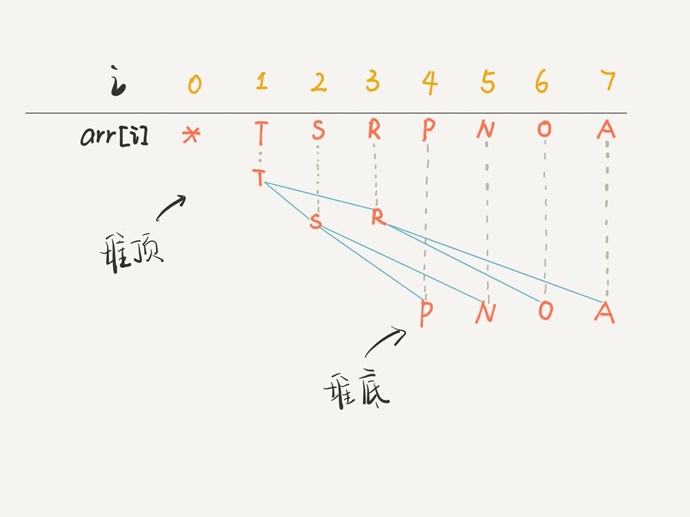
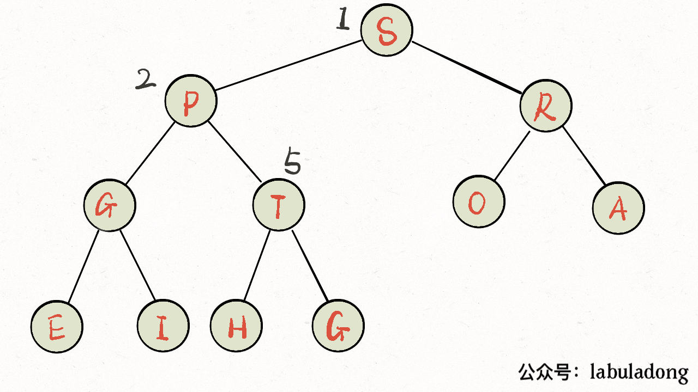
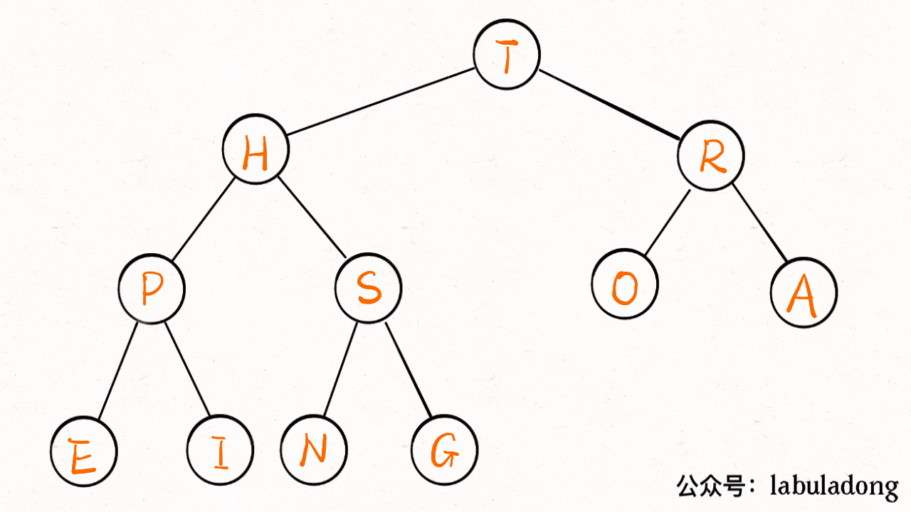
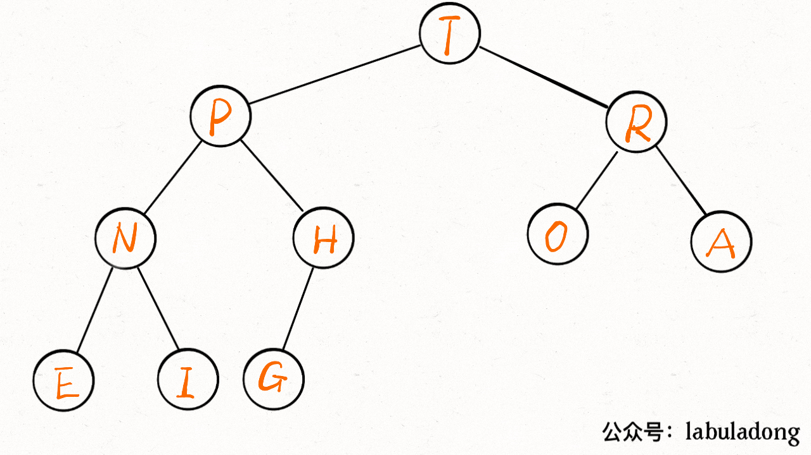
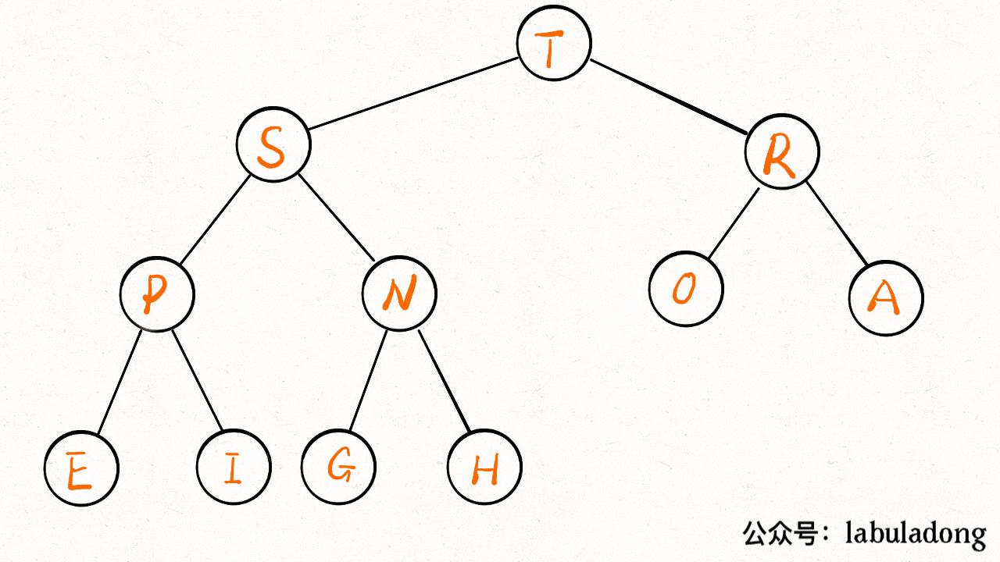

`最大堆`: 本质上是个完全二叉树，只不过存储在数组里。一般的链表二叉树，我们操作节点的指针，而在数组里，我们把数组索引作为指针。
且每个节点都大于等于它的两个子节点

画个图就能理解了，比如 arr 是一个字符数组，注意数组的第一个索引 0 空着不用：

将`arr[1]`作为整颗树的根，每个节点的父节点和左右孩子的`索引`都可以通过简单的运算得到，这就是二叉堆设计的一个巧妙之处。

除了基础的left, right, parent, exch(交换两元素), less(比较两元素大小)这几个基础的方法之外，还有四个关键的方法: swim(上浮), sink(下沉), insert(插入), delMax(删除并返回最大元素)

1. **上浮(swim)的过程示意图：**

2. **下沉(sink)的过程示意图：**

3. **插入：**
insert 方法先把要插入的元素添加到堆底的最后，然后让其`上浮`到正确位置

3. **删除最大元素：**
delMax 方法先把堆顶元素 A 和堆底最后的元素 B 对调，然后删除 A，最后让 B `下沉`到正确位置。
