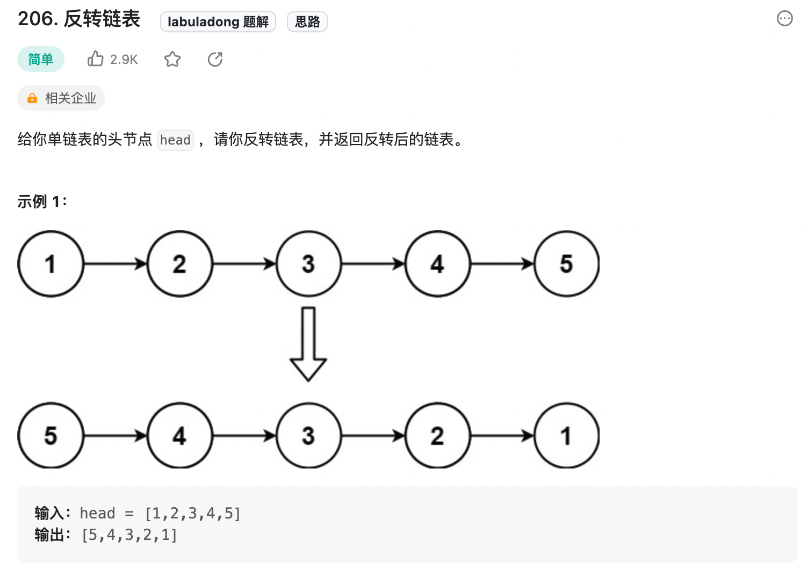
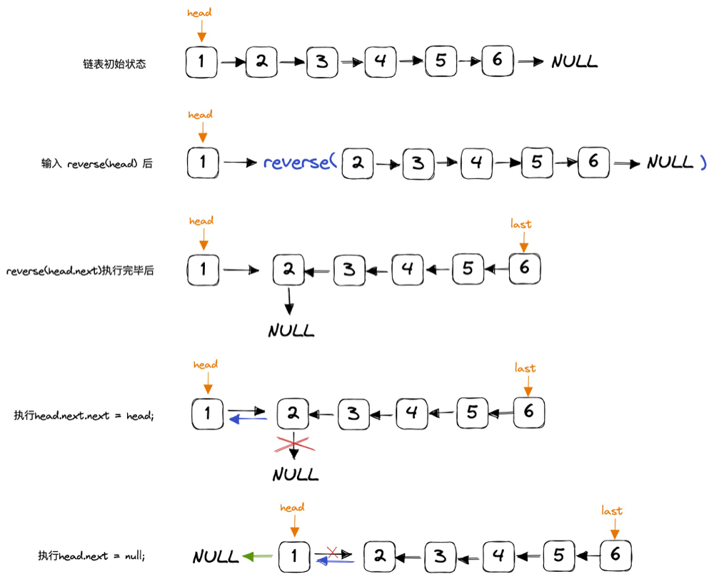

直接看代码实现:
```js
// 定义：输入一个单链表头结点，将该链表反转，返回新的头结点
var reverse = function(head) {
    if (head == null || head.next == null) {
        return head;
    }
    let last = reverse(head.next);
    head.next.next = head;
    head.next = null;
    return last;
}
```
解释：
