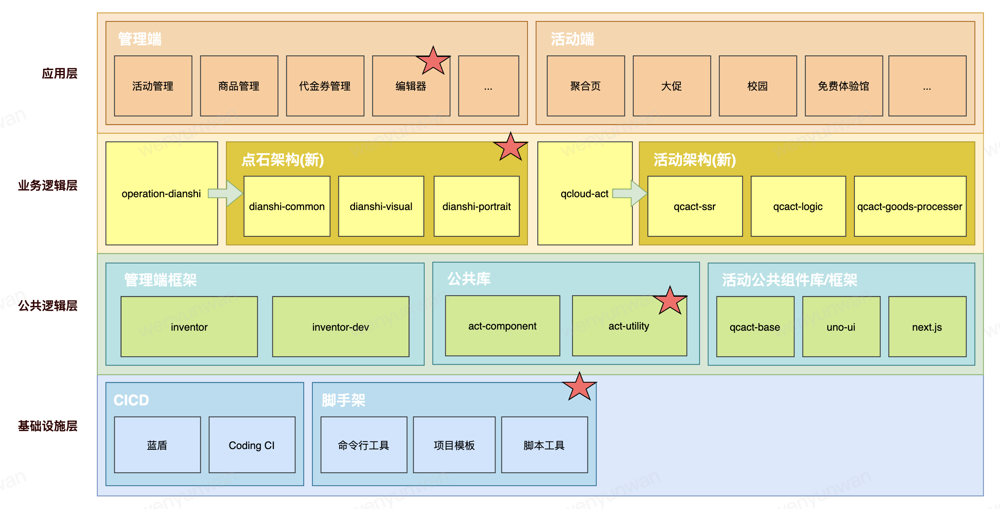
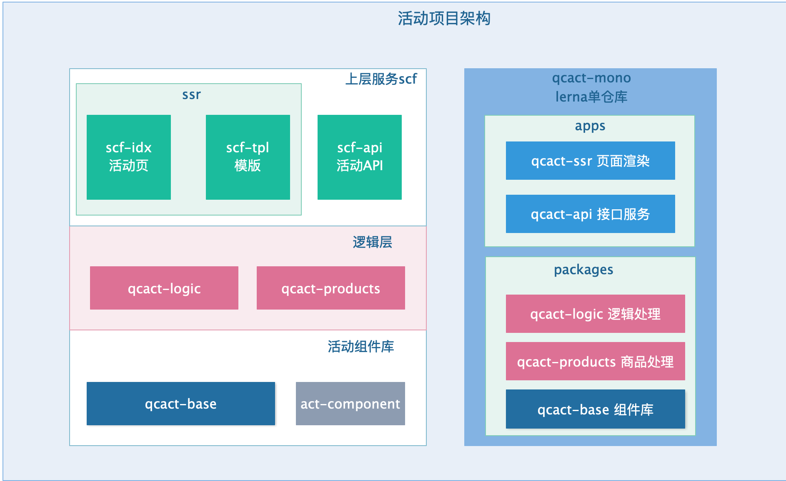

面试考察点：项目处理能力以及解决方案。

可从以下纬度（步骤）开始复习：
1. 先了解设计方案，再了解局部细节。

2. 运营活动怎么做登录的？怎么判断用户的登录态？

2. 然后为什么要这么设计，有什么优缺点？

3. 除了这样做，还有没有其他的实现方式，业界的处理方案有对比过吗

4. 怎么解决活动页的配置，怎么做低代码（模版活动）？你们的ssr 方案是怎么处理的，活动组件是怎么做复用的，整体的框架设计是怎样的

5. 你们怎么做的分层设计，比如api层面是怎么做多业务的数据抹平

6. 定制化活动了解活动骨架屏怎么做的

7. 了解定制化活动原理

* 模版编辑器原理
* qcact-ssr 为什么既有koa又有next？