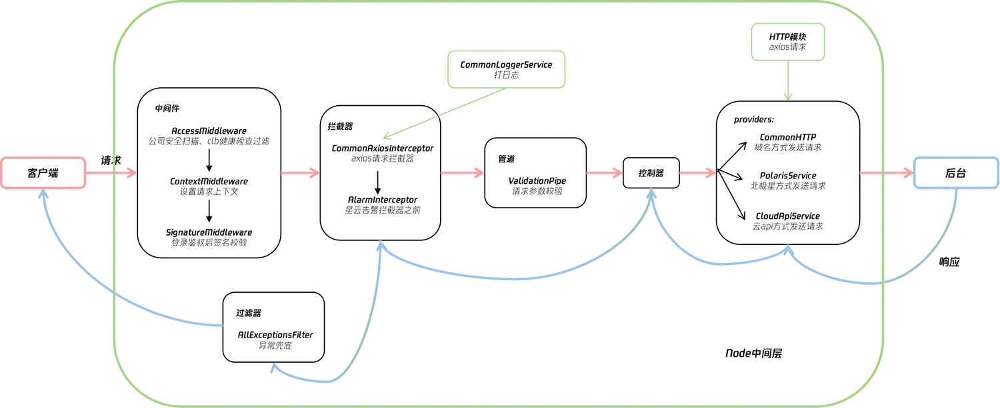
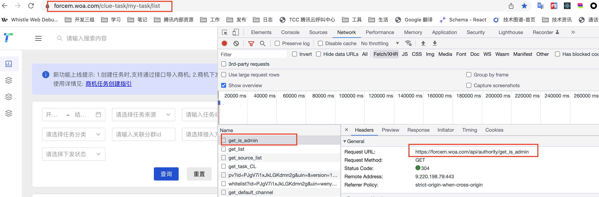
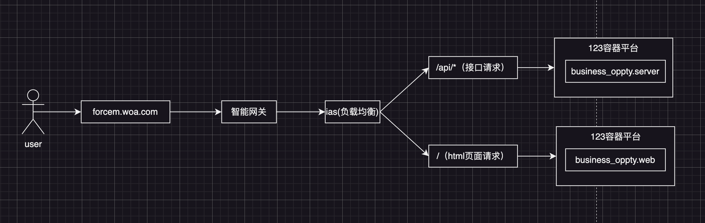
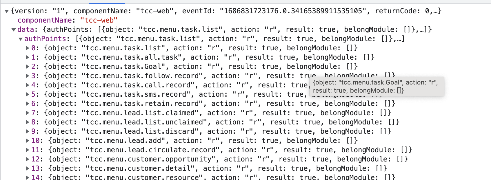
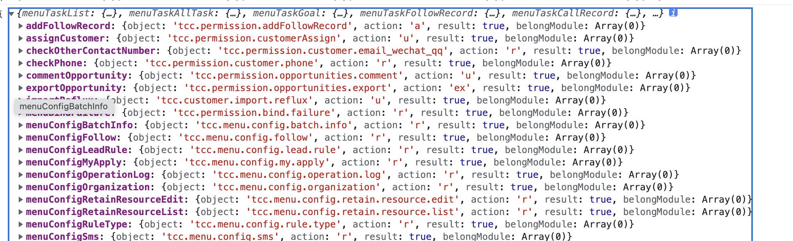
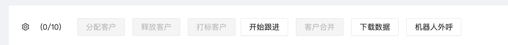
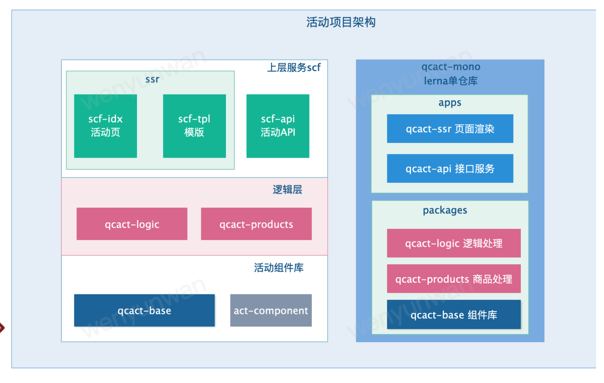
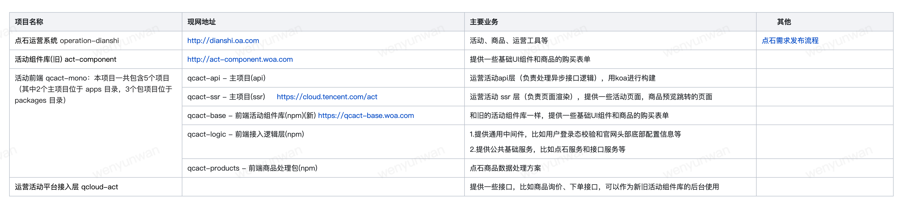
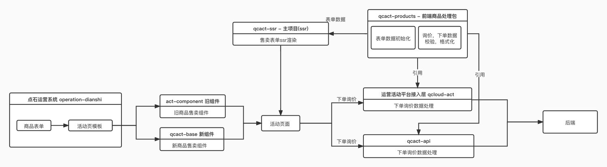

- [商机线索管理系统](#商机线索管理系统)
  - [预设问题](#预设问题)
      - [如何保证系统的健壮性？](#如何保证系统的健壮性)
      - [本地如何联调？](#本地如何联调)
      - [搭建平台的过程中，有没有遇到哪些卡点？是如何解决这些卡点的？](#搭建平台的过程中有没有遇到哪些卡点是如何解决这些卡点的)
      - [为什么需要再搭建 BFF 层？因为由前端同学再去维护一个 BFF 层的服务是有人力输出的？是有哪些特殊的诉求吗？](#为什么需要再搭建-bff-层因为由前端同学再去维护一个-bff-层的服务是有人力输出的是有哪些特殊的诉求吗)
      - [那你们是如何解决与云api之间的跨域问题的呢？](#那你们是如何解决与云api之间的跨域问题的呢)
      - [BFF 接口的 QPS （每秒请求量）有多大？应该不算是高并发的内部系统？](#bff-接口的-qps-每秒请求量有多大应该不算是高并发的内部系统)
      - [前端项目的构建打包工具用的是 webpack 还是 cra 还是其它的公司内部的工具？](#前端项目的构建打包工具用的是-webpack-还是-cra-还是其它的公司内部的工具)
      - [BFF 层的服务部署在公司内部的容器云中，是用的 pm 2 来作为 node 的进程管理工具吗？node服务在容器云是用什么方式起动的？](#bff-层的服务部署在公司内部的容器云中是用的-pm-2-来作为-node-的进程管理工具吗node服务在容器云是用什么方式起动的)
      - [BFF 的日志服务是怎么做的？](#bff-的日志服务是怎么做的)
      - [部署方案？鉴权方式（用户识别）？](#部署方案鉴权方式用户识别)
      - [从0到1搭建node，强调如何快速上手nest.js，突出学习能力。](#从0到1搭建node强调如何快速上手nestjs突出学习能力)
    - [如何处理请求文件数据类型？](#如何处理请求文件数据类型)
  - [遇到的问题或难点](#遇到的问题或难点)
    - [在使用Nest.js的时候遇到的问题 - 依赖注入](#在使用nestjs的时候遇到的问题---依赖注入)
    - [难点：权限控制](#难点权限控制)
- [TCC腾讯云外呼系统](#tcc腾讯云外呼系统)
  - [预设问题](#预设问题-1)
      - [对外和对内系统的区别](#对外和对内系统的区别)
      - [在做这个这个系统迭代有什么你觉得的主要的难点吗，还是就是基本的需求迭代](#在做这个这个系统迭代有什么你觉得的主要的难点吗还是就是基本的需求迭代)
      - [大部分页面是表单， 梳理清楚如何获取到顶部筛选项的值来更新下面的table数据。有没有想过优化？](#大部分页面是表单-梳理清楚如何获取到顶部筛选项的值来更新下面的table数据有没有想过优化)
      - [登陆怎么实现？如何部署？如何做监控？](#登陆怎么实现如何部署如何做监控)
      - [切换容器部署之后的缓存问题](#切换容器部署之后的缓存问题)
- [腾讯云活动运营](#腾讯云活动运营)
  - [问题](#问题)

# 商机线索管理系统

商机管理系统针对不同来源的线索进行统一的收集、信息补全和下发，系统化地打通腾讯云各团队的线索。可以帮助运营人员快速录入线索，下发给销售团队（直销、渠道、电销等）跟进，并对流转、转化的线索数据进行统一的监测和管理。从而帮助实现拉新、促留存、促续费、提升ARPU值、订单数等运营目标。

主要技术：
1.前端平台使用了 React 全家桶 + Typescript + TDesgin
2.使用 Nest.js 框架搭建 BFF 层

## 预设问题

#### 如何保证系统的健壮性？

比如前端平台系统的异常监控 与 BFF 层服务接口的稳定性如何保障？是否有接入腾讯内部的一些平台监控系统？

针对写操作的接口，有添加告警，是通过Nest的拦截器来实现的。在请求收到响应之后，根据返回的status值（http请求的）以及业务状态码（returnCode）来判断，该请求是否正常，如果不正常，则会触发告警，这个告警服务也是接入的我们公司的一个工具，触发之后，它会向指定的人员及群组推送告警信息。
```js 
  // 新建任务
  @Post('create_task')
  @UseInterceptors(AlarmInterceptor) // 告警拦截器
  createTask(@Body() Body: createTaskDataDTO) {
    return this.clueTasksService.createTask(Body);
  }
```
但http请求超时没有做告警处理，但会被异常过滤拦截到，并打印日志，方便排查问题。

关于监控，该项目对应的前端项目有接入公司的前端性能监控平台rum。

   
#### 本地如何联调？

利用了vite的server.proxy功能，进行请求的转发。这样的联调方式除了方  便，还天然解决了跨域问题(详见[《webpack相关面试题》](../%E5%B7%A5%E7%A8%8B%E5%8C%96/webpack%E7%9B%B8%E5%85%B3%E9%9D%A2%E8%AF%95%E9%A2%98.md))。
```js
server: {
  host: '0.0.0.0',
  port: 3003,
  proxy: {
    '/api': {
      // 用于开发环境下的转发请求
      // 更多请参考：https://vitejs.dev/config#server-proxy
      target: 'http://127.0.0.1:3000', // 表示的是代理到的目标地址。
      // target: 'http://busniess-oppty.testsite.woa.com',
      changeOrigin: true, //它表示是否更新代理后请求的 headers 中host地址。
    },
  },
},
```

#### 搭建平台的过程中，有没有遇到哪些卡点？是如何解决这些卡点的？

没啥卡点，因为这个项目不太难。稍微有困难的地方就是在于nest框架的使用，这些问题也可以通过看官方文档以及事例项目来解决

#### 为什么需要再搭建 BFF 层？因为由前端同学再去维护一个 BFF 层的服务是有人力输出的？是有哪些特殊的诉求吗？

原因有以下几点：
- 我们的业务场景需要调用很多云api，web直接调云api会跨域
- 后台的服务是trpc服务，不能直接用http来调用。
- bff做了一些接口聚合，数据整合，智能网关身份校验（因为是内网系统，所以可以直接获取用户身份信息）等操作
 - 老板希望我们拓宽自身的知识面，并且我们团队当时后台人力吃紧，希望可以帮忙承接一些后台的工作量

  

- 本地开发联调走了一个[代理服务](https://git.woa.com/trpc-node/tools/http-proxy-server)，
- 线上环境，我们部署的容器平台自带代理能力，使得我们可以与trpc服务进行通信。

#### 那你们是如何解决与云api之间的跨域问题的呢？
   
- 本地联调利用了vite的`server.proxy`功能，来解决跨域问题。
- 线上环境：我们接入ias(底层能力是一个负载均衡)，在代码实现的时候针对请求会在路径上加上`/api`标识，在ias中配置的时候，将有`/api`标识的请求转发到我们的node服务上即可。
  
  这个时候，协议，域名，端口（80）均相同，便不会跨域了。

#### BFF 接口的 QPS （每秒请求量）有多大？应该不算是高并发的内部系统？
   
是个内部系统，并发量不大。

#### 前端项目的构建打包工具用的是 webpack 还是 cra 还是其它的公司内部的工具？

我们的前端项目是用的公司内的的桌面React框架，TDesign。它集成了`vite`来进行打包。

#### BFF 层的服务部署在公司内部的容器云中，是用的 pm 2 来作为 node 的进程管理工具吗？node服务在容器云是用什么方式起动的？
    
没有使用pm2，直接run起来的。这个也是可以优化的点。因为该系统使用的人不多，目前没有遇到太大的问题。

####  BFF 的日志服务是怎么做的？
   
用了winston来记录请求信息，再结合公司内部的日志服务CLS，就可以进行检索分析了

####  部署方案？鉴权方式（用户识别）？



####  从0到1搭建node，强调如何快速上手nest.js，突出学习能力。

请求、日志、告警、鉴权

###  如何处理请求文件数据类型？

axios响应拦截器
`headers['content-type'] === '"application/octet-stream"'`
```js
// 下载文件
export const downloadFile = (
  fileName: string, // 指定的文件名
  content: ArrayBuffer, // content
  type = 'application/vnd.openxmlformats-officedocument.spreadsheetml.sheet', // 文件的accept
) => {
  const aLink = document.createElement('a');
  const blob = new Blob([content], { type });
  aLink.download = fileName;
  aLink.href = window.URL.createObjectURL(blob);
  aLink.click();
};
```
`Blob` 对象表示一个不可变、原始数据的类文件对象。它的数据可以按文本或二进制的格式进行读取，也可以转换成 ReadableStream 来用于数据操作。

Blob 表示的不一定是 JavaScript 原生格式的数据。File 接口基于 Blob，继承了 blob 的功能并将其扩展以支持用户系统上的文件。

## 遇到的问题或难点
### 在使用Nest.js的时候遇到的问题 - 依赖注入
**问题（现象）：**
二次封装httpService，得到PolarisService，以便调用内部服务。需在多个模块中使用。总是报错找不到`httpService`。

**原因：**
我只在PolarisService里面注入了httpService，但却没有在module中定义HttpModule。导致程序找不到对应的类。

对框架理解的不够。

**解决办法：**
抽出来了一个common.module，在这里统一定义HttpModule。让Providers的依赖看起来相对清晰一点。

**理解依赖注入：**
你的类全部由 nest 的 IOC 来管理，你不需要去 new 一个类，他会用单例模式（默认），nest可以帮我拿到这个类的实例。
除了在构造函数中注入依赖，你还可以在方法或属性上使用装饰器来注入依赖。Nest.js 支持三种类型的注入：
1. 构造函数注入：直接在构造函数中声明需要注入的依赖。
  ```typescript
  @Injectable()
  export class SomeService {
      constructor(private readonly otherService: OtherService) {}
  }
  ```
2. **属性注入**：将依赖注入到类的属性中。我使用的方式
  ```typescript
  @Injectable()
  export class SomeService {
      @Inject() private readonly otherService: OtherService;
  }
  ```
3. 方法注入：将依赖注入到方法中。
  ```typescript
  @Injectable()
  export class SomeService {
      private otherService: OtherService;
      @Inject()
      setOtherService(otherService: OtherService) {
          this.otherService = otherService;
      }
  }
  ```

### 难点：权限控制
**难在哪？**
我们的系统要给多个业务团队，多个用户角色使用。不同的团队，不同用户角色看到的页面菜单和读写操作是不一样的。

**思路：**
1. 借助公司式内部的权限管理平台，为用户注册权限。
2. 通过后台叫接口拉取当前用户权限信息
3. 前端对权限信息进行分析，并根据结果控制展示的页面和可操作的行为

**代码层面的实现：**
1. **注册权限点**：这一步相当与是给全局涉及到权限问题的地方注册了一个字典。方便后续跟获取到的用户权限信息进行比对，来控制展示的页面和可操作的行为。
   ```js
   const AUTH_POINT_MAP = {
    /* 路由 菜单 */
    menuTaskList: 'tcc.menu.task.list-r',
    menuTaskAllTask: 'tcc.menu.task.all.task-r',

    /* 其它 */
    modifyPermission: 'tcc.permission.authority-u',
    robotOutBound: 'tcc.permission.robot.outbound.call-a',
   }
   ```
2. **路由、侧边菜单栏配置改造**：增加权限点标识。表明，用户的这个权限点标识为true，才可以访问（看到）
   ```js
   // 侧边菜单栏
   const routes: MenuItem[] = [
      {
        key: 'kanban',
        title: '数据看板',
        url: '/kanban',
        Icon: <LineChartOutlined />,
        authPoints: ['menuReportKanban'],
        belongModule: [moduleId.MID_LONG_TAIL_ID],
      },
   ]
   ```
   ```js
   // 路由
   const routes: MenuItem[] = [
     {
       key: 'config.my.apply',
       path: '/config/my-apply',
       exact: true,
       needLogin: true,
       component: MyApplyPage,
       authPoints: ['menuConfigMyApply'],
     },
   ]
3. 自定义`useAppConfigs`：该hook会在应用程式的入口(App.tsx)执行，其工作具体如下
   - **调用接口，获取用户权限点信息**，包含具体权限点标识字符串，action(读、写)，
     
   - **设置全局状态`AuthPointMap`**，会对获取到的权限点信息进行整理，方便一眼看该权限点是控制哪个页面的，该用户是否有权限。然后再设置全局状态
     
   - **过滤有权限的路由和菜单并返回**
   - 并返回获取用户权限点信息请求的loading态
  此时，在App入口处久可以得到该用户有权限的路由和菜单了，再进行渲染即可。
4. **在App.txs中优化获取用户权限点接口还没返回的情况**，`useAppConfigs`返回的loading，则给用户提示“加载中...”
5. **针对非菜单、路由的权限控制，比如按钮**，如下图中按钮，改用户有该按钮的权限点，按钮才可以用，否则不展示。
   
   
   **具体实现如下：**
   1. **封装公共权限组件`<AuthChecker>`**：
      1. 该组件的props为一个字符串表示，使用该组件需要有的权限点标识。
      2. 在该组件中，读取前面定义设置好的全局状态，`AuthPointMap`。
      3. 在AuthPointMap中查询，用户是否有该组件的权限（是否为true）。便可确定组件的展示结果。
   **使用**
   ```js
   <AuthChecker points="robotOutBound">
     <Button onClick={() => setShowRobotOutBoundForm(true)}>机器人外呼</Button>
   </AuthChecker>
   ```
> 为什么设置页面级别的权限点粒度？
> 角色很多，可能角色1，需要abc页面，角色2，需要ade页面，角色3又需要ceg页面
# TCC腾讯云外呼系统

TCC是腾讯云业务内部使用的外呼平台，核心功能有TCC进行线索/客户分配、座席管理等，涉及客户管理、线索管理、任务管理、配置管理等模块。支持多业务线客服坐席通过平台向客户或合作伙伴进行外呼，以实现电话销售、客户关怀和调研等目的。

使用 React 全家桶 + Typescript + TDesign（前端组件库）搭建平台前端页面。

## 预设问题

#### 对外和对内系统的区别

这个系统也是对内的，看你的简历可能偏向做内部系统多一些，如果我们这边是做对外的系统，你觉得 对外和对内的系统，对于技术上的要求最大的区别是什么？做对外的系统，你觉得对前端来说，更多的要考虑哪些因素。

对外的系统需要将更多的精力放在系统的稳定性上，需要将系统的监控做完善，落实到每一个细节。另外，对外的系统在用户交互上需要考虑机制，和 UI 设计的同学有更多的沟通，让对外的产品能做到更好。技术上需要考虑前端性能优化问题，比如首屏加载时间。

#### 在做这个这个系统迭代有什么你觉得的主要的难点吗，还是就是基本的需求迭代

没什么难点

#### 大部分页面是表单， 梳理清楚如何获取到顶部筛选项的值来更新下面的table数据。有没有想过优化？
    
用两个自定义组件和一个自定义hook来实现
```jsx
    const {
      loading,
      list,
      pagination,
      setFilter,
      resetFilter,
      rowKey,
    } = useTableService(listRobotCallRecord, initFilter, '获取机器人外呼通话列表失败')
    <CommonFilters
      cRef={filterRef}
      className="custom-Label"
      itemList={robotCallRecordFilterItems}
      onSubmit={filter => setFilter({ ...filter,  page:1 })}
      onReset={() => resetFilter(initFilter)}
    />
    <Table
      loading={loading}
      scroll={{ x: tableXWidth }}
      tableLayout="fixed"
      className="mt20"
      rowKey={rowKey}
      dataSource={robotCallRecordList}
      columns={columns}
      pagination={pagination}
    />
    ...
```
自定义`useTableService`hook，入参有接口请求函数、请求初始参数、请求错误提醒。会返回loading，数据，分页，筛选等相关的数据及方法。

自定义`<CommonFilters>`组件，使用配置化的方式，生成`form`表单。并在点击确定按钮的时候，通过`onSubmit`回调，触发自定义`useTableService`返回的`setFilter`方法来更新筛选项的值，从而触发接口的请求，请求返回的数据（是个`state`）绑定到table上。就完成了获取顶部筛选项的值来更新下面的table数据的过程。(react数据更新原理详见[《React核心原理-状态更新》](../%E5%89%8D%E7%AB%AF%E6%A1%86%E6%9E%B6//React/React%E6%A0%B8%E5%BF%83%E5%8E%9F%E7%90%86//React%E6%A0%B8%E5%BF%83%E5%8E%9F%E7%90%863-%E7%8A%B6%E6%80%81%E6%9B%B4%E6%96%B0.md))

是否可以用formilyjs来实现？其实意义不大。
   
#### 登陆怎么实现？如何部署？如何做监控？

登陆：每次都会去调用`GetUserInfo`接口拉取用户信息，如果返回状态码为401，则跳转到登陆页面。

部署：部署在云开发的静态网站托管上，并与业务域名进行了关联。是全量发布。

监控：接入了公司内部的rum性能监控平台，以及sentry来进行错误跟踪。

#### 切换容器部署之后的缓存问题


# 腾讯云活动运营

该部分工作主要涉及两个业务系统：
1.ToB的点石运营平台 
是提供给腾讯云内部各运营团队进行官网活动配置搭建与管理、代金券申请与发放、多维度用户触达等运营行为的平台。提供了腾讯云官网运营相关资源的快捷管理，减少研发成本。
2.ToC的腾讯云官网活动
腾讯云官网活动承接的腾讯云各产品线大型促销活动页面，以及限时秒杀、免费体验馆、云+校园、云+创业活动等主题活动板块。并提供可配制化售卖卡片组件，结合点石运营平台，使运营人员可无代码、快速搭建活动页上线以满足运营需求。

- 点石运营平台使用 React 全家桶 + Antd（前端组件库）+ Formily来搭建中后台系统。
- 腾讯云官网活动使用 React 全家桶 + Typescript + Next.js + Koa进行搭建。通过 Next.js 服务端渲染的方案进行搭建活动页面，以减少首次加载时间，提升用户体验。

## 问题
1. 你觉得 Formily 的方案适合哪些场景？你在使用其过程中有遇到什么难点吗？因为就其官网的文档来看，上手难度还是挺大的，你是怎么上手的？对于一个新人来接手 formily 这块内容来看，我个人觉得是挺难得，需要前人留下比较完善的文档才好交接。
web/activity/src/components/new_goods/helper/schema.jsx
    
    打断点一步步调试。
2. 说到 Formily，其实也是低代码方案的一种，对复杂的模块进行逻辑抽象，你对于低代码的了解有多少？公司内部是否有比较完整的低码平台？你觉得低码平台适用在什么场景的业务比较合适呢？
   
    低代码平台适用于表单比较多的业务系统，因为表单的交互逻辑可抽象化，这也是目前我了解到最实用的场景。像该项目，需要接入很多云产品。但每个云产品的配置不同，但需要配置的项（套餐时长，地区，带宽等等）却是有限个的，这种情况下，只需要归纳总结好配置规则，即可与后台同学配合使用formily来进行低代码化的表单页面的配置与搭建。

3. 腾讯云活动页 使用 Next.js进行服务端渲染，有对比过不用服务端渲染的方案和用服务端渲染的方案性能差别有多大吗？


4. 腾讯云活动页是对外的，需要考虑一些性能指标，那你对前端性能优化了解有多少（比如CDN图片加上 webp 可以减少图片的大小，却不影响图片的质量）？

    详见[《前端性能优化》](../%E5%B7%A5%E7%A8%8B%E5%8C%96/%E5%89%8D%E7%AB%AF%E6%80%A7%E8%83%BD%E4%BC%98%E5%8C%96.md)

5. 假如你到一个公司，要搭建一个新项目，你如何评估这个项目是否需要使用服务端渲染方案？
   
    toC的业务场景会需要用到服务端渲染，首屏需加载的资源较多，接口请求较多的情况。

6. 你们是如何实现快速搭建活动页的? // TODO
   
7. **Koa+Next.js搭建项目。详细说说？**
    
    这里 ssr 层的职责很简单，就是负责服务端渲染。然而服务端渲染涉及到很多数据拉取以及中间件等功能，我们调用基础的 qcact-logic提供服务，获取数据与鉴权，确保 ssr 层足够简单和职责足够单一。

    qcact-ssr 采用业界标准 react 服务端渲染框架 nextjs + koa 进行构建，引入 koa 主要是为了能够利用 koa 的中间件机制，预处理一些请求数据，以及一些鉴权等操作（这方面，nextjs 是不具备的）。

    - next.js自带服务器，但是它可以做的事情很有限，只能处理ssr渲染。 所以一般我们可以将next.js作为koa的一个中间件来使用。

    - Koa 比较轻量，几乎没有内置任何的额外功能，灵活度也很高，可以自己加很多中间件。


    
    

8. qcact-logic和qcact-api项目有什么区别？ // TODO

    - qcact-logic:
      - middlewares：提供通用中间件，比如：1. 注入 http 请求上下文，将 ctx 挂载到 req 和 res 上；2. 注入官网头部底部配置信息；3. 用户登录态校验
      - services：提供公共基础服务，比如：1. dianshi：点石服务（包括活动相关的接口功能服务，包括商品，秒杀，配置等）2. logger：日志服务，对标准输出流进行格式化，并提供常用的 event，供业务系统日志打点分析；3. rainbow：七彩石服务，提供七彩石配置拉取能力 4. request：请求服务，基于 axios 对请求能力进行封装，包括常规的日志打点，计时，以及默认配置；5. exception：异常服务，自动捕获全局异常，进行日志打点，提供告警
   - qcact-api: 本身是一个部署在serverless上的云函数，底层使用了qcact-logic的能力